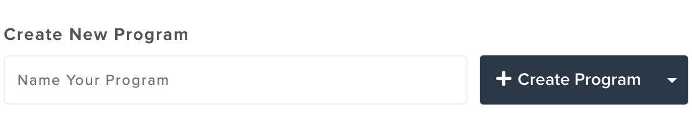
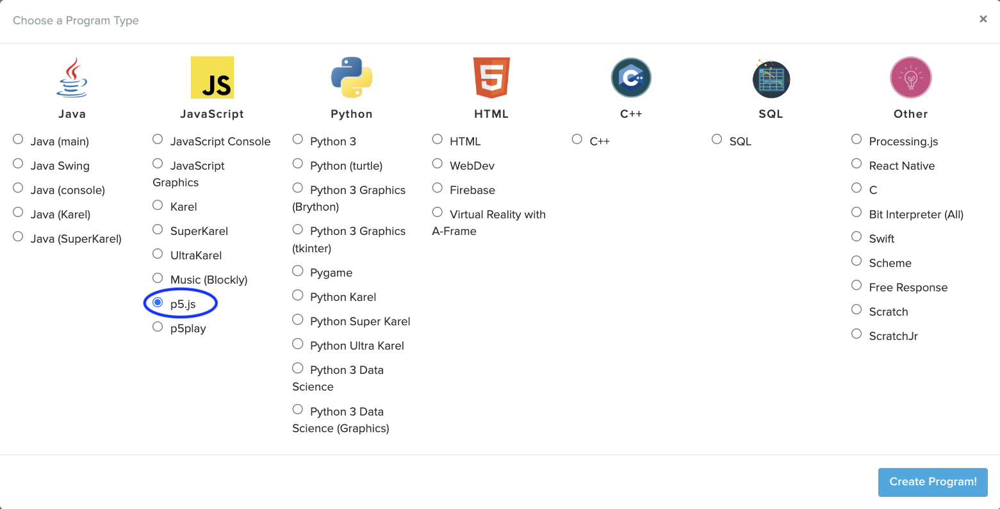
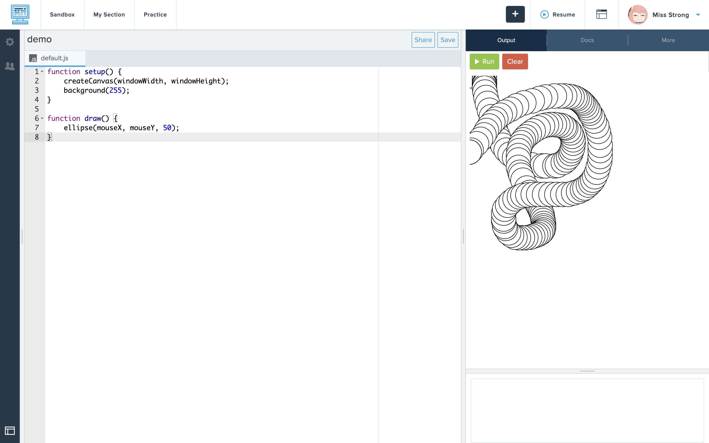

# Link to video.

### CodeHS

In this course, we will be using [CodeHS](http://codehs.com) to write programs. CodeHS is a web-based programming environment. It is not the best programming environment, however we are using it since it can run on Chromebooks.

### Sandbox

We can create programs through the Sandbox. Click on **Sandbox** in the top-left corner.


Enter a name for your program and click **Create Program**.



Here is what our programming environment on CodeHS looks like:

Select **p5.js** as the progam type and click **Create Program!**.



Here is your programing environment:


### Source Code Editor

The **source code editor** is the place where we type in the code for our program. In CodeHS, the source code editor is the window in the middle of the screen. The numbers along the left side of the source code editor are the **line numbers**.

The source code editor displays our code using **syntax highlighting**. Different parts of our code light up in different colours based on various categories. Different source code editors have different colour schemes.

We will see **red squiggly lines** when we have a **syntax error**, similar to how we see a red squiggly line when we mispell a word in a text editor such as Google Doc. **Syntax** refers to the rules of a programming language, similar to how grammar refers to the rules of a human language. We will also see **green squiggly lines** for warnings.

### Settings

We can click on the gear icon (⚙️) on the left side of the screen to access the settings. Here we can change things like the theme and font size.

### What is P5.js?

In this course, we will be creating computer programs using **P5.js**. The "P" stands for "Processing", since it's based on a Java library called Processing, and the 5 comes from the original website for Processing: http://proce55ing.net/.

P5.js is a JavaScript **library**. A library is a collection of files that makes it easier for us to do specific tasks in our program. This library allows us to write code that draws sketches. We can draw shapes, add colour, make them move around, use the mouse and keyboard to interact with the sketch, and much more.

### What does P5.js Code Look Like?

Here is an example of a P5.js program in Replit. We'll be deconstructing it little by little thoughtout the first few days of the course.

```javascript
function setup() {
    createCanvas(windowWidth, windowHeight);
    background(255);
}

function draw() {
    ellipse(mouseX, mouseY, 50);
}
```



### Where to Lookup Information about P5.js

*Everything* about P5.js can be found on the its official site: https://p5js.org/.
