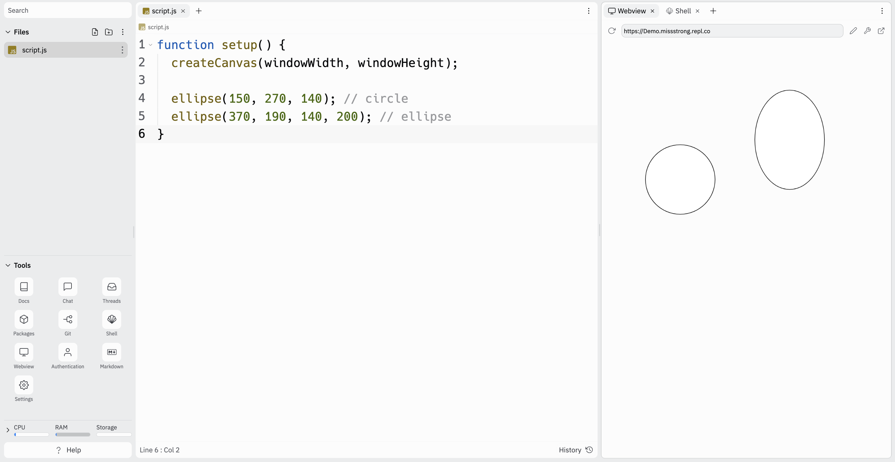
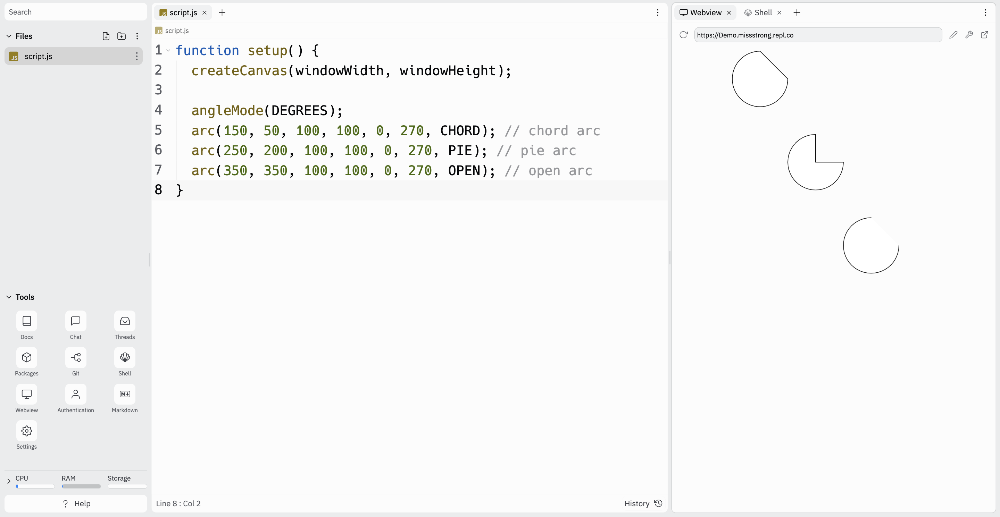

# [Link to video.](https://www.youtube.com/watch?v=Am4do2N7ASc&list=PLVD25niNi0BnKbPM0lUEfNYcWixQZ98cY)

### The `ellipse()` Function

We use `ellipse()` to draw circles and ellipses. Ellipses are like circles except they have a the horizontal diameter and the vertical diameter. This function takes three or four parameters: an *x*-value, a *y*-value, a horizontal diameter, and an optional vertical diameter. By default, (*x*, *y*) is the center of the circle or ellipse using the coordinate system described above

```javascript
function setup() {
  createCanvas(windowWidth, windowHeight);

  ellipse(150, 270, 140); // circle
  ellipse(370, 190, 140, 200); // ellipse
}
```



### The `arc()` Function

An **arc** is a curve along the circumference of a circle. We use the `arc()` function to draw arcs. This function takes the same four parameters as `ellipse()`, but it also takes three more: the starting point, the ending point, and the mode. 

By default, the starting and ending points are written in **radians**. Radians are a unit used to measure the size of an angle, just like degrees. Radians usually aren't taught until Grade 12 Advanced Functions, so it'll be easier for us to use degrees. To use degrees instead, call `angleMode(DEGREES)`. If we want to change it back to radians, we can call `angleMode(RADIANS)`.

Here are a few significant points of an ellipse:

*  0° is the right-most point
*  90° or -270° is is the bottom-most point
*  180° is the left-most point
*  270° or -90°  is the top-most point

There are three modes for the arc:

* `CHORD` (a line is drawn from the start and end point)
* `PIE` (it looks like a pie)
* `OPEN` (there is no line drawn from the start and end point)

If we don't specify the mode, it will default to `OPEN`.

```javascript
function setup() {
  createCanvas(windowWidth, windowHeight);

  angleMode(DEGREES);
  arc(150, 50, 100, 100, 0, 270, CHORD); // chord arc
  arc(250, 200, 100, 100, 0, 270, PIE); // pie arc
  arc(350, 350, 100, 100, 0, 270, OPEN); // open arc
}
```


