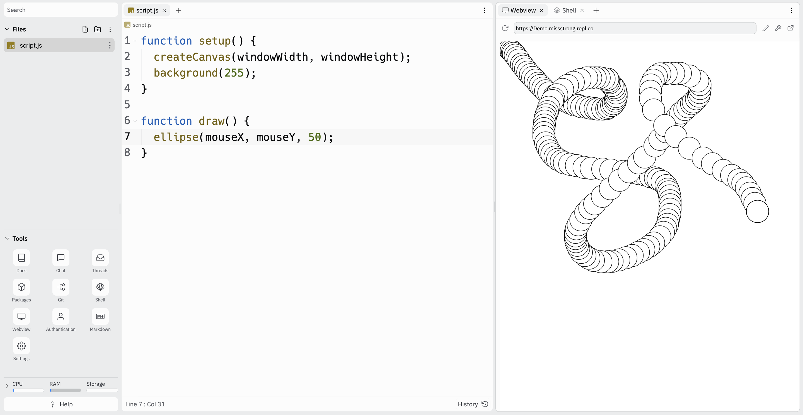

# [Link to video.](https://www.youtube.com/watch?v=EwdV2fv3KoA&list=PLVD25niNi0BnKbPM0lUEfNYcWixQZ98cY)

### The `draw()` Function

`draw()` is a built-in function that is overridable, meaning we can choose what it does. The difference between `setup()` and `draw()` is that `setup()` is called before `draw()` and `draw()` is called repeatedly at a rate of ≤60 times per second. 

To override `draw()`, we write the following:

```javascript
function draw() {
  
}
```

Inside the curly braces `{}` we write the code we want to run repeatedly.

### `mouseX` and `mouseY`

`mouseX` and `mouseY` are built-in variables that store the current coordinates of your cursor. We can use them in the `draw()` function to repeatedly draw shapes following the cursor.

```javascript
function setup() {
  createCanvas(windowWidth, windowHeight);
  background(255);
}

function draw() {
  ellipse(mouseX, mouseY, 50); // follows the mouse
}
```



If we want to modify it so that only one circle shows up at a time, we can move `background(100);` to the body of `draw()`.

```javascript
function setup() {
  createCanvas(windowWidth, windowHeight);
}

function draw() {
  background(100);
  ellipse(mouseX, mouseY, 50); // follows the mouse
}
```


The reason this works is that the `draw()` function repeatedly redraws the background, which covers up the previous circle. 

The reason the circle isn't flickering is that the canvas updates at the _end_ of each cycle of `draw()`, so we see the changes to the screen all at once instead of one line at a time.

### `pmouseX` and `pmouseY`

There are also built-in variables for the most recent mouse coordinates: `pmouseX` and `pmouseX` (the "p" stands for previous).

We can use this to track the movement of the mouse.

```js
function setup() {
  createCanvas(windowWidth, windowHeight);
}

function draw() {
  line(pmouseX, pmouseY, mouseX, mouseY); // draws a line from the two most recent mouse coordinates
}
```

This program will continuously draw a line every time the mouse moves, leaving a trail of the places the cursor has been to.


