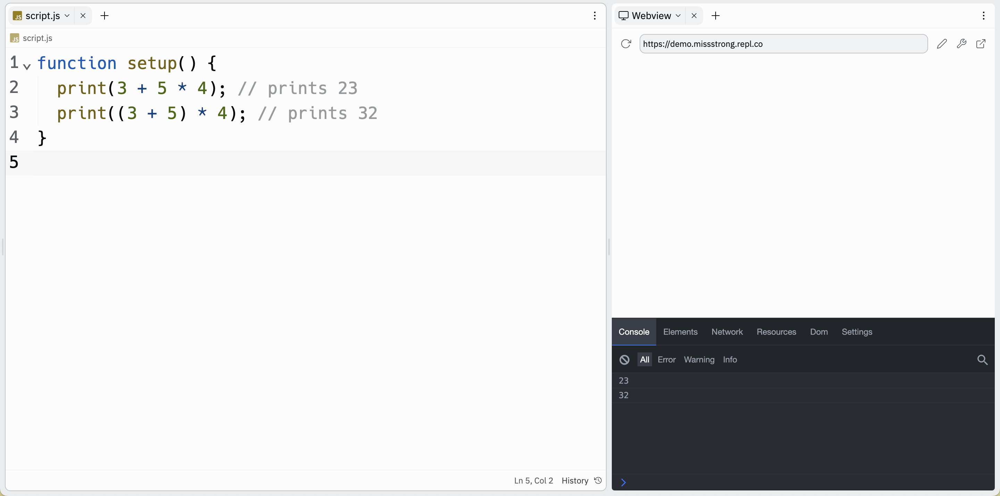

# [Link to video.](https://www.youtube.com/watch?v=Lc290iV6zLk&list=PLVD25niNi0BnKbPM0lUEfNYcWixQZ98cY)

### The print() Function

The `print()` function writes information in the console. To see the console, click on the wrench icon.


This is useful for letting us see what values our variables are storing.


### Arithmetic Operators

**Operators** are symbols that perform an operation. Here are the ones we can use for arithmetic:

* Addition operator: `+`
* Subtraction operator: `-`
* Multiplication operator: `*`
* Division operator: `/`
* Exponent operator: `**` (*not* `^`)

### Order of Operations

The order of operations for arithmetic operators is BEDMAS. 

```js
function setup() {
  print(3 + 5 * 4); // prints 23
  print((3 + 5) * 4); // prints 32
}
```


