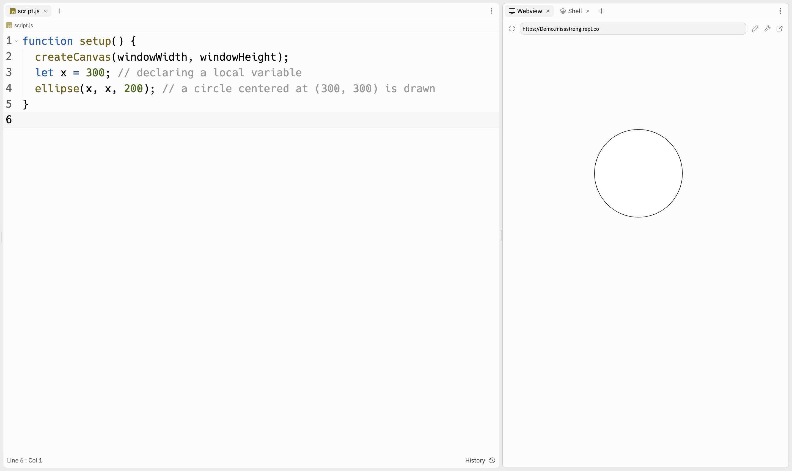
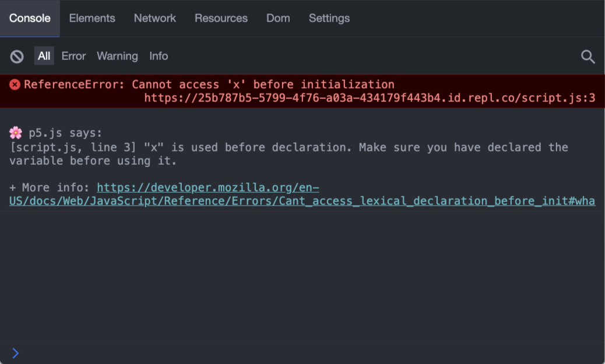

# [Link to video.](https://www.youtube.com/watch?v=6ykTwm0Tusw&list=PLVD25niNi0BnKbPM0lUEfNYcWixQZ98cY)

### Scope

**Scope** refers to the places within a program where a variable can be accessed. In JavaScript, variables can have **block scope**, **function scope**, or **global scope**.

A **keyword** is a reserved word that has a special purpose. The keyword for declaring a variable with block scope is `let`. This keyword was added to JavaScript in 2015 and it is currently the preferred way of making a local variable. When we declare a variable using `let`, that variable can only be used within the same block after it's declared. 

```javascript
function setup() {
  createCanvas(windowWidth, windowHeight);
  let x = 300; // declaring a local variable
  ellipse(x, x, 200); // a circle centered at (300, 300) is drawn
}
```



If we try to use a variable before we declare it using `let`, the program will crash. The error message will say **Reference Error**.

```javascript
function setup() {
  createCanvas(windowWidth, windowHeight);
  ellipse(x, x, 200); // this doesn't work since coordinate hasn't been declared yet
  let x = 300; 
}
```



The keyword for declaring a variable with function scope is `var`, which is short for "variable". When we look at other people's JavaScript code online, we will likely see the keyword `var` a lot. It's actually an outdated keyword as of 2015 and now the preferred keyword is `let` since it's uncommon to want a variable with function scope as opposed to block scope. 

An interesting result of using function scope is that we can use variable before we declare them. However, this is usually undesired behaviour (if we wanted to use the variale earlier, we would just declare them earlier). If you're curious about how this works, it's because `var` variables are **hoisted** (you can look up what this means if you're interested).

```js
function setup() {
  createCanvas(windowWidth, windowHeight);
  ellipse(coordinate, coordinate, 200); // this actually works
  var coordinate = 300; 
}
```

There is no keyword for declaring a global variable. We simply just omit a keyword.

```js
function setup() {
  createCanvas(windowWidth, windowHeight);
  coordinate = 300; // declaring a global variable
  ellipse(coordinate, coordinate, 200); // this works
}
```

Since we can use global variables throughout our program, we can use it in a different block of code than the one it was declared in.

```javascript
function setup() {
  createCanvas(windowWidth, windowHeight);
  coordinate = 300; // declaring a global variable
}

function draw() {
  ellipse(coordinate, coordinate, 200); // this works
}
```

We can also consider the entire file to be one large block, so we can declare variables at the top of the file. When we do this, the convention is to use `let`, although the program will still work without `let`.

```javascript
let coordinate = 300; // declaring a global variable (this also works if we omit "let")

function setup() {
  createCanvas(windowWidth, windowHeight);
}

function draw() {
  ellipse(coordinate, coordinate, 200); // this works
}
```

Whenever we have a global variable that is assigned a value later in the program, it's good practice to declare it at the top of the file to make our program more easily readable.

```javascript
let coordinate; // declaring a global variable but not assigning a value to it yet

function setup() {
  createCanvas(windowWidth, windowHeight);
  coordinate = 300; // assigning a value to the global variable from before
}

function draw() {
  ellipse(coordinate, coordinate, 200); // this works
}
```

However, we can't just put anything we want at the very top of the file. For example, we can only call P5.js functions from within other P5.js functions such as `setup()` and `draw()`.

```javascript
print(height); // this doesn't work

function setup() {
  createCanvas(windowWidth, windowHeight);
}
```
