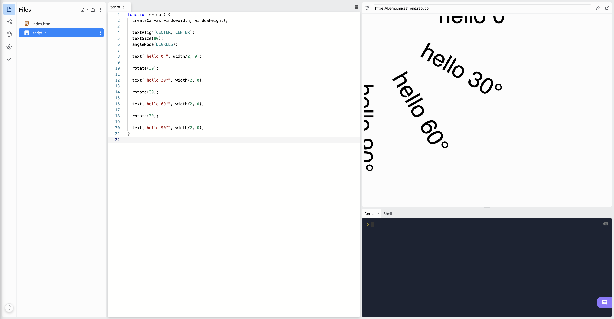
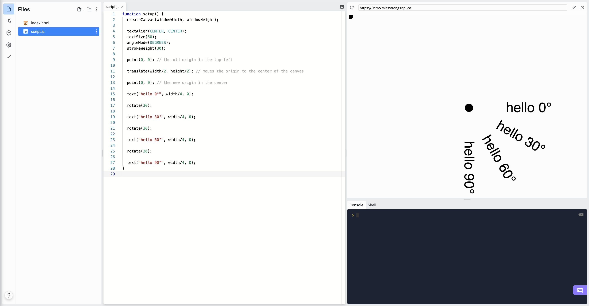
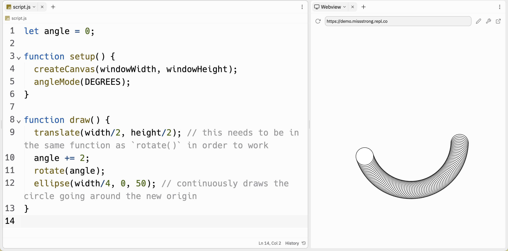

# [Link to video.](https://www.youtube.com/watch?v=qJP5rqGvBGU&list=PLVD25niNi0BnKbPM0lUEfNYcWixQZ98cY)

### Rotations

We can rotate shapes, text, and images using `rotate()`. It takes an angle and rotates everything after it clockwise around the origin.

```js
function setup() {
  createCanvas(windowWidth, windowHeight);

  textAlign(CENTER, CENTER);
  textSize(80);
  angleMode(DEGREES);

  text("hello 0°", width/2, 0);

  rotate(30);

  text("hello 30°", width/2, 0);
  
  rotate(30);

  text("hello 60°", width/2, 0);
  
  rotate(30);

  text("hello 90°", width/2, 0);
}
```



The `rotate()` function always rotates around the origin, but if we want it to rotate around a different point, we can move the origin using `translate()`. The `translate()` function takes the x-coordinate and y-coordinate of the new origin.

```js
function setup() {
  createCanvas(windowWidth, windowHeight);

  textAlign(CENTER, CENTER);
  textSize(50);
  angleMode(DEGREES);
  strokeWeight(30);
  
  point(0, 0); // the old origin in the top-left

  translate(width/2, height/2); // moves the origin to the center of the canvas

  point(0, 0); // the new origin in the center

  text("hello 0°", width/4, 0);

  rotate(30);

  text("hello 30°", width/4, 0);
  
  rotate(30);

  text("hello 60°", width/4, 0);
  
  rotate(30);

  text("hello 90°", width/4, 0);
}
```



The effects of `translate()` and `rotate()` only last until the end of the function they are called in. If we want to call `rotate()` in `draw()` to get a continuously rotate something, we should store the angle in a variable and increment the variable.


```js
let angle = 0;

function setup() {
  createCanvas(windowWidth, windowHeight);
  angleMode(DEGREES);
}

function draw() {
  translate(width/2, height/2); // this needs to be in the same function as `rotate()` in order to work
  angle += 2;
  rotate(angle);
  ellipse(width/4, 0, 50); // continuously draws the circle going around the new origin
}
```


