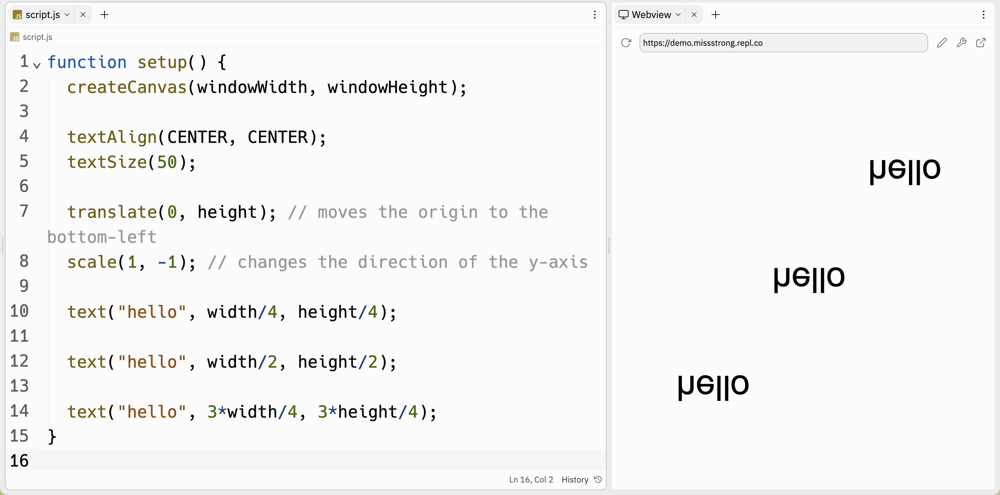

### Reflections

If we want to reflect a shape, text, or image, we can use `scale()`. The `scale()` function takes a value to stretch/compress/reflect the x-axis and another value to stretch/compress/reflect the y-axis. To reflect an axis, we use a value of `-1`. We can combine this with `translate()` to change the coordinate system to be backwards.

The example below moves the origin and changes the direction of the x-axis to create coordinate system:


```js
function setup() {
  createCanvas(windowWidth, windowHeight);

  textAlign(CENTER, CENTER);
  textSize(50);
  angleMode(DEGREES);

  translate(width, 0); // moves the origin to the top-right
  scale(-1, 1); // changes the direction of the x-axis

  text("hello", width/4, height/4);

  text("hello", width/2, height/2);

  text("hello", 3*width/4, 3*height/4);
}
```


The example below moves the origin and changes the direction of the y-axis to create coordinate system:


```js
function setup() {
  createCanvas(windowWidth, windowHeight);

  textAlign(CENTER, CENTER);
  textSize(50);
  angleMode(DEGREES);

  translate(0, height); // moves the origin to the bottom-left
  scale(1, -1); // changes the direction of the y-axis

  text("hello", width/4, height/4);

  text("hello", width/2, height/2);

  text("hello", 3*width/4, 3*height/4);
}
```



The example below moves the origin and changes the direction both axes to create coordinate system:


```js
function setup() {
  createCanvas(windowWidth, windowHeight);

  textAlign(CENTER, CENTER);
  textSize(50);
  angleMode(DEGREES);

  translate(width, height); // moves the origin to the bottom-right
  scale(-1, -1); // changes the direction of both axes

  text("hello", width/4, height/4);

  text("hello", width/2, height/2);

  text("hello", 3*width/4, 3*height/4);
}
```


