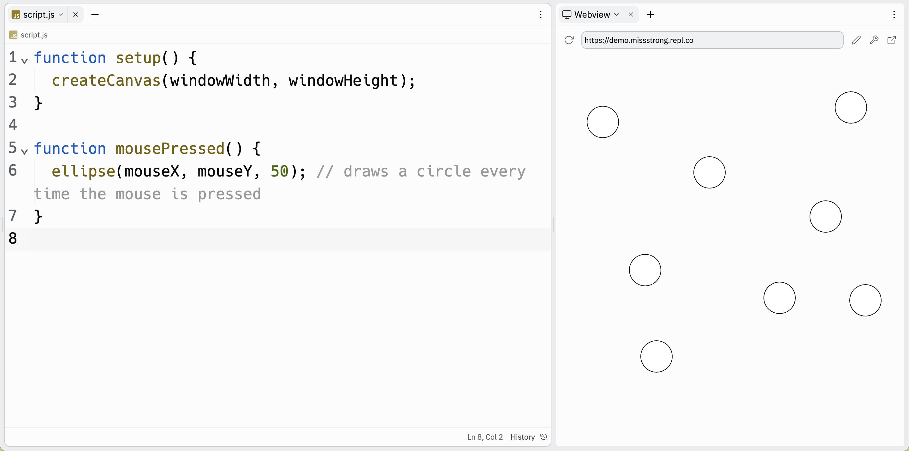
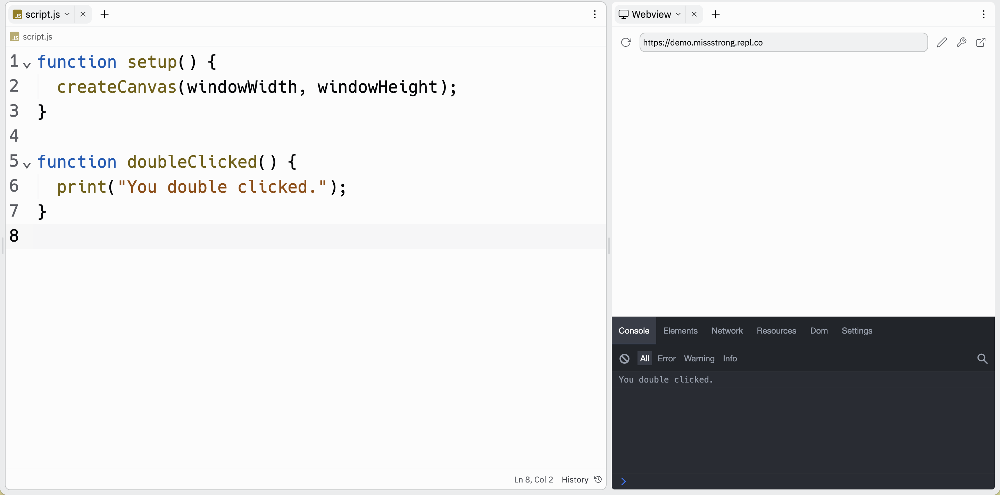

# [Link to video.](https://www.youtube.com/watch?v=nRbGOoGJQIw&list=PLVD25niNi0BnKbPM0lUEfNYcWixQZ98cY)

### Mouse Pressing

If we want to detect a mouse press, we can use the `mousePressed()` function. This type of function is called an  **event listener** or an **event handler**, since it gets called as soon as a particular event occurs. In this case, the event is a mouse button being pressed.

The way we use the `mousePressed()` function is similar to `setup()`, `preload()`, `draw()`.  We are overriding it, so we need the keyword `function` and we fill in the body of the function with what we want to happen when a mouse button is pressed. 

This example draws a circle in a random place each time the mouse is pressed.

```js
function setup() {
  createCanvas(windowWidth, windowHeight);
}

function mousePressed() {
  ellipse(mouseX, mouseY, 50); // draws a circle every time the mouse is pressed
}
```




For double clicking the left mouse button, there's `doubleClicked()`.

```js
function setup() {
  createCanvas(windowWidth, windowHeight);
}

function doubleClicked() {
  print("You double clicked.");
}
```



If we want something to happen when a mouse button is released as opposed to when it's first pressed, we can use `mouseReleased()` instead. However, in Replit this only works for left and midde clicks, since right clicking on the canvas open a menu.

```js
function setup() {
  createCanvas(windowWidth, windowHeight);
}

function mouseReleased() {
   print("You let go of the left mouse button.");
}
```


Later we'll see how to detect which mouse buttons were pressed (left, middle, or right click).
