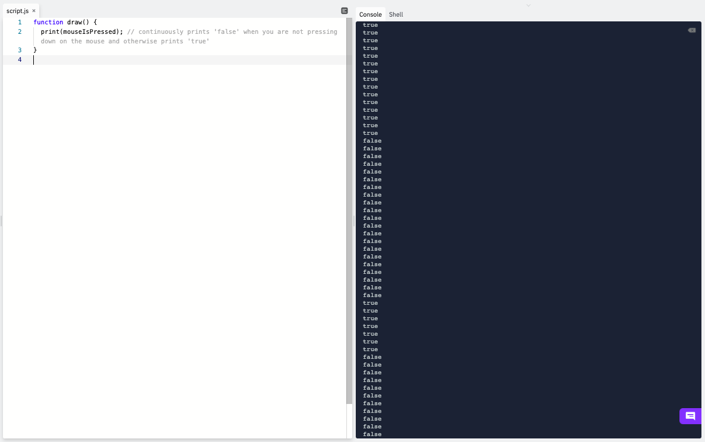
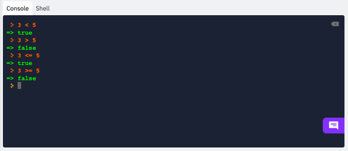
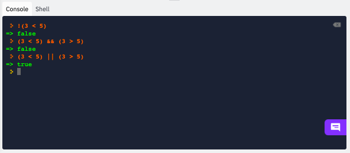

# [Link to video.](https://www.youtube.com/watch?v=pW2Seay9abw&list=PLVD25niNi0BnKbPM0lUEfNYcWixQZ98cY)

### Booleans

There are two **Boolean values**: `true` and `false`. Although they are words, they are not strings (there are no quotation marks around them). The word "Boolean" is named after George Boole, a logician from the 1800s. 

The variables `mouseIsPressed` and `keyIsPressed` are some examples of built-in Boolean variables in P5.js.

*  `mouseIsPressed` is `true` when the mouse is currently being pressed down and `false` otherwise.
*  `keyIsPressed` is `true` when any key on the keyboard is currently being pressed down and `false` otherwise.

```js
function draw() {
  print(mouseIsPressed); // continuously prints true or false depending on whether the mouse is being pressing down
}
```


### Boolean Expressions

We can create **Boolean expressions** using various types of operators.

**Comparison operators** compare the magnitudes of two numbers to produce a `true` or `false` statement.

| Operator Name | Operator Symbol | Example| Explanation |
| --- | --- | --- | --- |
| Less Than | `<` | `3 < 5` | 3 is less than 5, so the expression is `true`. |
| Greater Than | `>` | `3 > 5 ` | 3 is not greater than 5, so the expression is `false`. |
| Less Than or Equal To | `<=` | `3 <= 5` | 3 is less than or equal to 5, so the expression is `True`.<br /> `<=` is supposed to look like the ≤ symbol. |
| Greater Than or Equal To | `>=` | `3 >= 5` | 3 is neither greater than nor equal to 5, so the expression is false.<br />`>=` is supposed to look like the ≥ symbol. |



**Equality operators** check whether two numbers are equal or not equal to produce a `true` or `false` statement.

| Operator Name | Operator Symbol | Example | Explanation |
| --- | --- | --- | --- |
| Equals | `==` | `3 == 5 ` | 3 is not equal to 5, so the expression is `false`.<br/></br>Mixing up `=` and `==` is a notorious error in computer science. This applies to many programming languages, not just JavaScript. |
| Not Equals | `!=` | `3 != 5` | 3 is not equal to 5, so the expression is `true`.<br />`!=` is supposed to look like the ≠ symbol. |

In JavaScript, we also have `===` and `!==` when we want to ensure that the two values belong to the same data type. For now we can stick with `==` and `!==`.


**Boolean operators** combine two or more Boolean expressions to produce a `true` or `false` statement. By convention, their names are written in capital letters.

| Operator Name | Operator Symbol | Example | Explanation |
| --- | --- | --- | --- |
| NOT | `!` | `!(3 < 5) ` | The statement in the parentheses is `true`, so the expression is the negation of that, which is `false`. |
| AND | `&&` | `(3 < 5) && (3 > 5)` | At least one of those two statements is `false`, so the expression is `false`.<br/></br>There is a similar operator, `&`, called a bitwise operator, which does something completely different. Look it up if you're interested. |
| OR | `\|\|` | `(3 < 5) \|\|(3 > 5)` | At least one of those two statements is `true`, so the expression is `true`.<br></br>There is a similar operator, `\|`, called a bitwise operator, which does something completely different. Look it up if you're interested.<br></br>The pipe character is typically found above or beside the ENTER key on your keyboard. |



### Order of Operations

We know that the order of arithmetic operations is BEDMAS, but what about all the other operations we've seen so far?

If we do not use any brackets, this is the order from highest precedence to lowest precedence:

1. `(` and `)`
2. `!`
4. `*` and `/`
5. `+` and `-`
6. `<`, `>`, `<=`, and `>=`
7. `==`, `!=`, `===`, and `!==`
8. `&&`
9. `||`
10. `=`

In general we should use brackets when we have an expression that has many operators so that we don't have to memorize the order of operations. 
