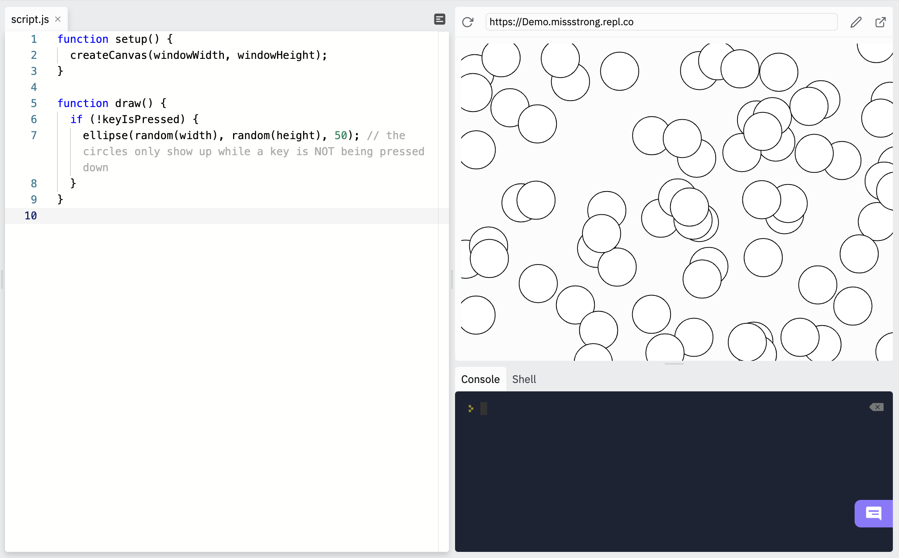

# [Link to video.](https://www.youtube.com/watch?v=tNM14MRtQxw&list=PLVD25niNi0BnKbPM0lUEfNYcWixQZ98cY)

### Conditionals

In a **conditional structure**, certain blocks are run only when certain conditions are met. We use Booleans to create these conditions.

The simplest type of conditional structure is called an **if statement**, which use the keyword `if`.

An `if` statement uses keyword `if` followed by a Boolean value or Boolean expression enclosed in parenthesis, followed by a block of code enclosed in curly braces. In the block, we write the code that we want to run when the condition is met. 

Here is an example of an `if` statement. This draws circles where the cursor is, but only when the mouse is pressed down.

```js
function setup() {
  createCanvas(windowWidth, windowHeight);
}

function draw() {
  if (mouseIsPressed) { 
    ellipse(mouseX, mouseY, 50, 50); // the circles only show up when the mouse is being pressed down
  }
}
```


Here's another example. This keeps drawing circles when we are pressing down on a key and it stops drawing them when we let go of all the keys.

```js
function setup() {
  createCanvas(windowWidth, windowHeight);
}

function draw() {
  if (keyIsPressed) { 
    ellipse(random(width), random(height), 50); // the circles only show up while a key is being pressed down
  }
}
```


If we want the opposite value of a Boolean, we can use the **NOT operator**, which is the exclamation mark symbol `!`.

This is a slight modification of the first example. This draws a circle where the cursor is, but only when the mouse is NOT pressed down.

```js
function setup() {
  createCanvas(windowWidth, windowHeight);
}

function draw() {
  if (!mouseIsPressed) { 
    ellipse(mouseX, mouseY, 50, 50); // the circles only show up when the mouse is NOT pressed down
  }
}
```


And here's a slight modification of the second example. This keeps drawing circles when we are NOT pressing down on a key and it stops drawing them when we press down any key.

```js
function setup() {
  createCanvas(windowWidth, windowHeight);
}

function draw() {
  if (!keyIsPressed) { 
    ellipse(random(width), random(height), 50); // the circles only show up while a key is NOT being pressed down
  }
}
```


