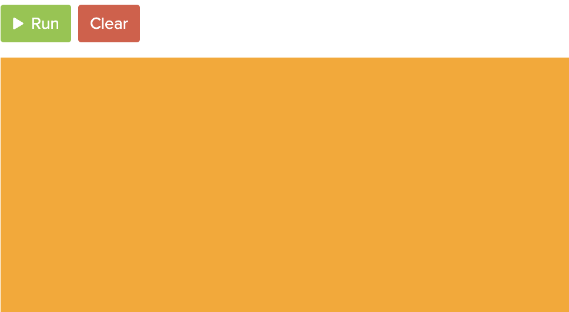
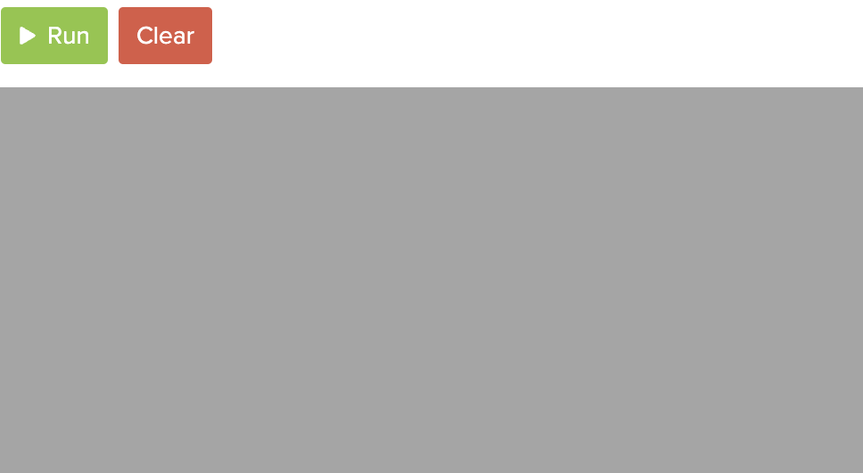

# Link to video.


### RGB Values

All colours that can be displayed on a computer can be expressed using a combination of 24 zeros and ones (i.e. binary digits, a.k.a. bits). One of the most common ways of indicating a colour is to use its red-green-blue (**RGB**) value. An RGB value shows how to create the colour using combinations of red, green, and blue light. It is often represented as a **tuple** in which each number is an 8-bit integer ranging from 0 (no light) to 255 (a lot of light). Like a coordinate, a tuple is an ordered sequence of numbers surrounded by parentheses.

Here are the RGB values of common colours.

| Colour | RGB value |
| --- | --- |
| Black  | (0, 0, 0) |
| White  | (255, 255, 255) |
| Red    | (255, 0, 0) |
| Orange | (255, 165, 0) |
| Yellow | (255, 255, 0)  |
| Green  | (0, 255, 0) |
| Blue   | (0, 0, 255) |
| Purple | (128, 0, 128) |
| Pink   | (255, 192, 203) |

### The `background()` Function

We can use `background()` to change the colour of the canvas. If we give it one parameter between 0 and 255, the background will be a black, white, or grey colour. If we give it three parameters between 0 and 255, the background will be an RGB colour.

```javascript
function setup() {
    createCanvas(windowWidth, windowHeight);
    background(255, 165, 0); // makes the background orange
}
```



If we give `background()` just one parmeter, it will use that number for R, G, and B. If all three numbers are the same, we get white (255), black (0), or grey (any number between 1 and 254).

```javascript
function setup() {
    createCanvas(windowWidth, windowHeight);
    background(165); // makes the background grey
}
```


