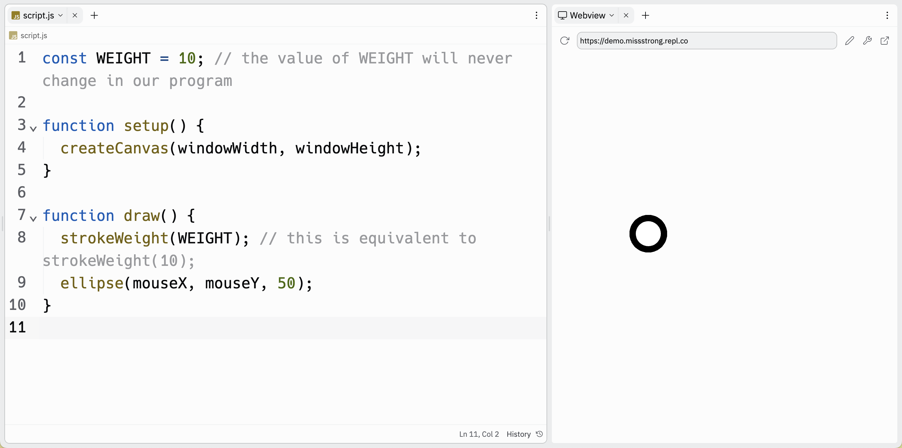

# [Link to video.](https://www.youtube.com/watch?v=WrA5iX_CHdU&list=PLVD25niNi0BnKbPM0lUEfNYcWixQZ98cY)

### Built-In Constants

We've come across the following **built-in constants**. They are built into P5.js and their values *do not change* while the program is running.

* `CENTER`, `CORNER`, and `CORNERS`
* `DEGREES` and `RADIANS`
* `CHORD`, `PI`, and `OPEN`
* `RIGHT`, `LEFT`, `TOP`, and `BOTTOM`
* `NORMAL`, `ITALIC`, `BOLD`, and `BOLDITALIC`

However, we can also make our own **custom constants** too. Just like custom variables, custom constants need to be declared and assigned a value. 

### Custom Contants

When we declare a constant we use the keyword `const` and then we give it a name. All constants have block scope, so the location we declare it in affects where we can access it.

In JavaScript, the convention is to name constants using **screaming snake case**, which is a variation of **snake case**. In snake case, all words are lower case and separated by underscores `_`. Snake case is used in languages like Python (which happens to be type of snake). In screaming snake case, all words are upper case and separated by underscores (imagine that the snake is screaming).

```javascript
const WEIGHT = 10; // the value of WEIGHT will never change in our program

function setup() {
  createCanvas(windowWidth, windowHeight);
}

function draw() {
  strokeWeight(WEIGHT); // this is equivalent to strokeWeight(10);
  ellipse(mouseX, mouseY, 50);
}
```


If we try to reassign the value of a constant, the console will say `TypeError: Assignment to constant variable.`.

```javascript
const WEIGHT = 10;

function setup() {
  createCanvas(windowWidth, windowHeight);
  WEIGHT = 20; // this does not work since we used "const" to declare WEIGHT
}

function draw() {
  strokeWeight(WEIGHT);
  ellipse(mouseX, mouseY, 50);
}
```
