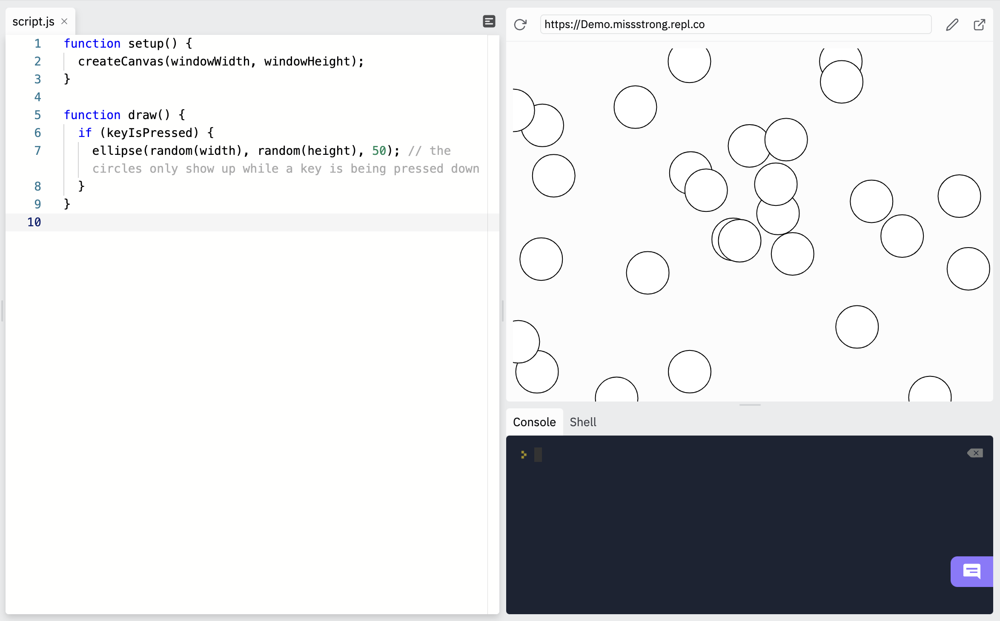
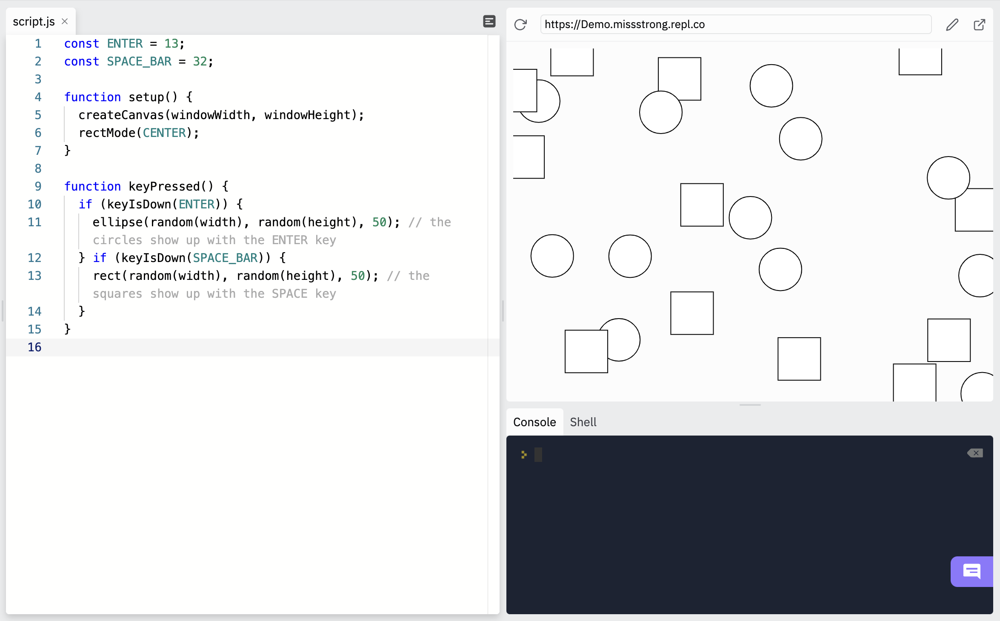
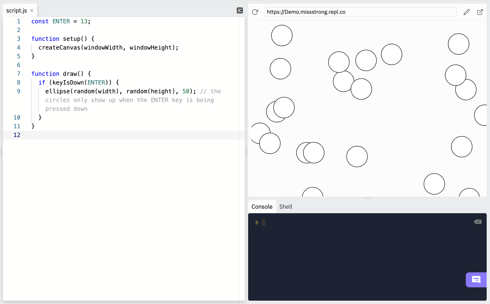

## Key Detection

So far we've seen the built-in variable `keyIsPressed` used to detect whether there is currently any key being pressed down. 

Here's an example from before. It keeps drawing circles when we are pressing down on a key and it stops drawing them when we let go of all the keys.

```js
function setup() {
  createCanvas(windowWidth, windowHeight);
}

function draw() {
  if (keyIsPressed) { 
    ellipse(random(width), random(height), 50); // the circles only show up while a key is being pressed down
  }
}
```



We can use `keyIsDown()` to check which keys are being pressed down. The `keyIsDown()` function takes a number represeneting a keycode and returns `true` if that key is currently being pressed down and `false` otherwise. 

According to [http://keycode.info](http://keycode.info/), the keycode for the enter key is 13. Now we can modify the previous example so that the circle is drawn only if the enter key is being pressed.

```js
const ENTER = 13;

function setup() {
  createCanvas(windowWidth, windowHeight);
}

function draw() {
  if (keyIsDown(ENTER)) { 
    ellipse(random(width), random(height), 50); // the circles only show up when the ENTER key is being pressed down
  }
}
```



We can use `keyIsDown()` within `keyPressed()` and `keyReleased()` too.

```js
const ENTER = 13;
const SPACE_BAR = 32;

function setup() {
  createCanvas(windowWidth, windowHeight);
  rectMode(CENTER);
}

function keyPressed() {
  if (keyIsDown(ENTER)) {
    ellipse(random(width), random(height), 50); // the circles show up with the ENTER key
  } if (keyIsDown(SPACE_BAR)) {
    rect(random(width), random(height), 50); // the squares show up with the SPACE key
  }
}
```


