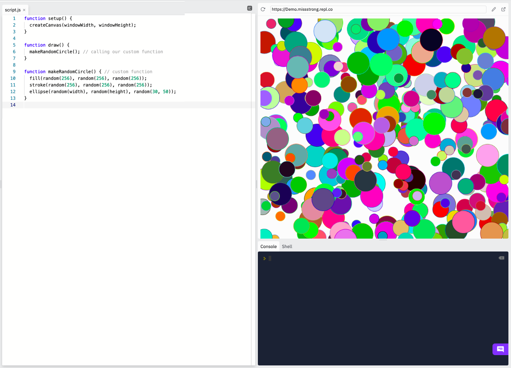

# [Link to video.](https://www.youtube.com/watch?v=buebbMm9Gw0&list=PLVD25niNi0BnKbPM0lUEfNYcWixQZ98cY)

### Functions

A function performs a sequence of steps used to accomplish a task. There are 289 functions that are built-in to P5.js. We can see them all on the [P5.js Reference Page](https://p5js.org/reference/). Here are just a few examples:

*  `setup()` is a function that is used to set up the canvas in its initial state 
*  `ellipse()` is a function used to draw an ellipse on the canvas
*  `fill()` is a function used to indicate what colour to fill in shapes and text
*  `random()` is a function that is used to generate a random value

### Custom Functions

We can create our own functions for us to use. This allows us to separate different parts of our code to make the program more readable. It's especially convenienet for preventing the same blocks of code repeated many times throughout our program. 

```js
function setup() {
  createCanvas(windowWidth, windowHeight);
}

function draw() {
  makeRandomCircle(); // calling our custom function
}

function makeRandomCircle() { // custom function
  fill(random(256), random(256), random(256));
  stroke(random(256), random(256), random(256));
  ellipse(random(width), random(height), random(30, 50));
}
```


