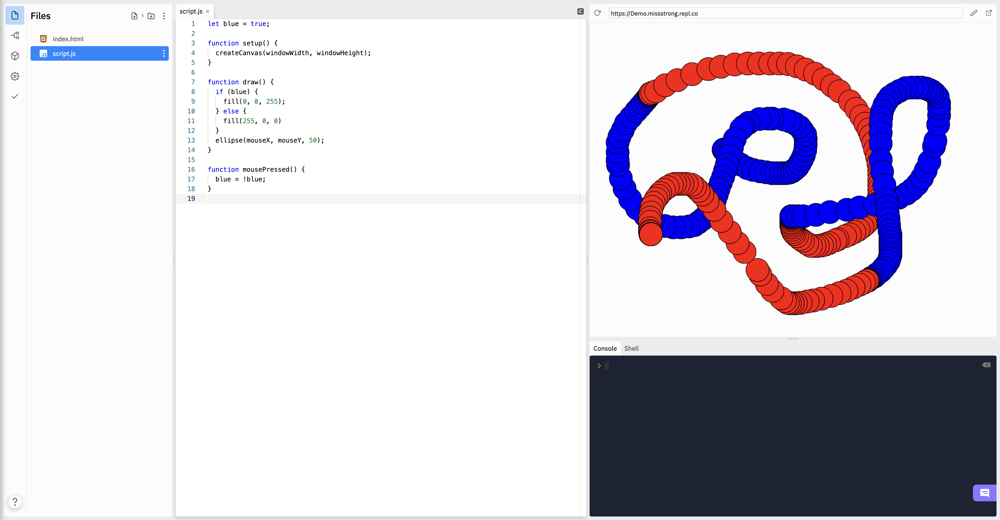

### Custom Boolean Variables

We can create our own boolean variables to keep track of whether something in our sketch is true or false. 

For example, suppose we are drawing circles and we want to change the colour back and forth by clicking the mouse. We can keep track of the current colour using a global boolean variable.

```js
let blue = true;

function setup() {
  createCanvas(windowWidth, windowHeight);
}

function draw() {
  if (blue) {
    fill(0, 0, 255); // blue circle
  } else {
    fill(255, 0, 0); // red circle
  }
  ellipse(mouseX, mouseY, 50);
}

function mousePressed() {
  blue = !blue; // changes the variable blue to the opposite of what it was before
}
```



The line `blue = !blue` changes the value from `true` to `false` or from `false` to `true`. It's equivalent to this:

```js
if (blue) {
  blue = false;
} else {
 blue = true;
}
```
