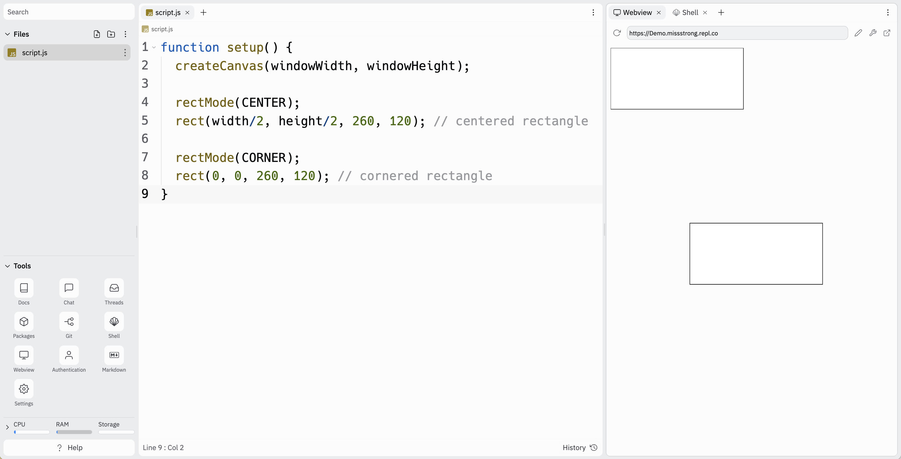
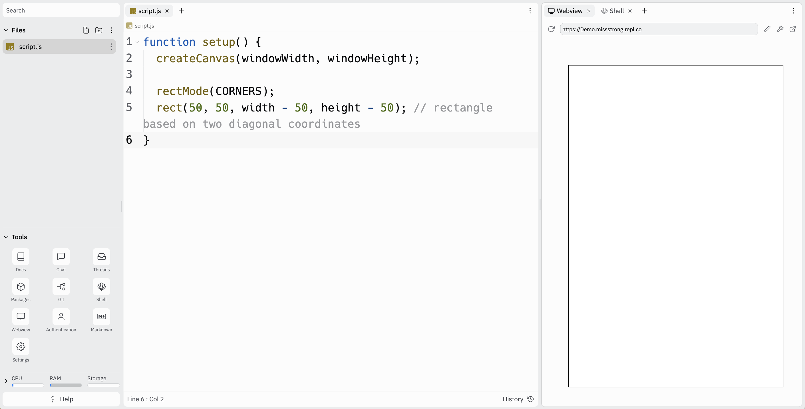

# Link to video.

### The `ellipse()` Function

We use `ellipse()` to draw circles and ellipses. Ellipses are like circles except they have a horizontal diameter and a vertical diameter. This function needs three or four parameters: an *x*-value, a *y*-value, a horizontal diameter, and an optional vertical diameter. By default, (*x*, *y*) is the center of the circle or ellipse using the coordinate system described previously.

```javascript
function setup() {
  createCanvas(windowWidth, windowHeight);

  ellipse(150, 270, 140); // circle
  ellipse(370, 190, 140, 200); // ellipse
}
```


### The `ellipseMode()` Function

If we want to draw a rectangle based on where its top-left corner is is, we can call `rectMode(CORNER)` before we call `rect()`. 

```javascript
function setup() {
  createCanvas(windowWidth, windowHeight);

  rect(400, 400, 200); // square

  ellipseMode(CORNER);
  ellipse(400, 400, 200); // circle drawn based on the corner of the square it's in
}
```

If we want to change it back to using the center, we can call `ellipseMode(CENTER)`.

```javascript
function setup() {
  createCanvas(windowWidth, windowHeight);
  
  ellipseMode(CORNER);
  ellipse(0, 0, 260, 120); // cornered circle

  ellipseMode(CENTER);
  ellipse(width/2, height/2, 260, 120); // centered circle
}
```



We could also create an ellipse using its top-left cordinate and its bottom-right coordinate using `ellipseMode(CORNERS)`.

```javascript
function setup() {
  createCanvas(windowWidth, windowHeight);
  
  rectMode(CORNERS);
  ellipse(50, 50, width - 50, height - 50); // ellipse based on two diagonal coordinates
}
```


