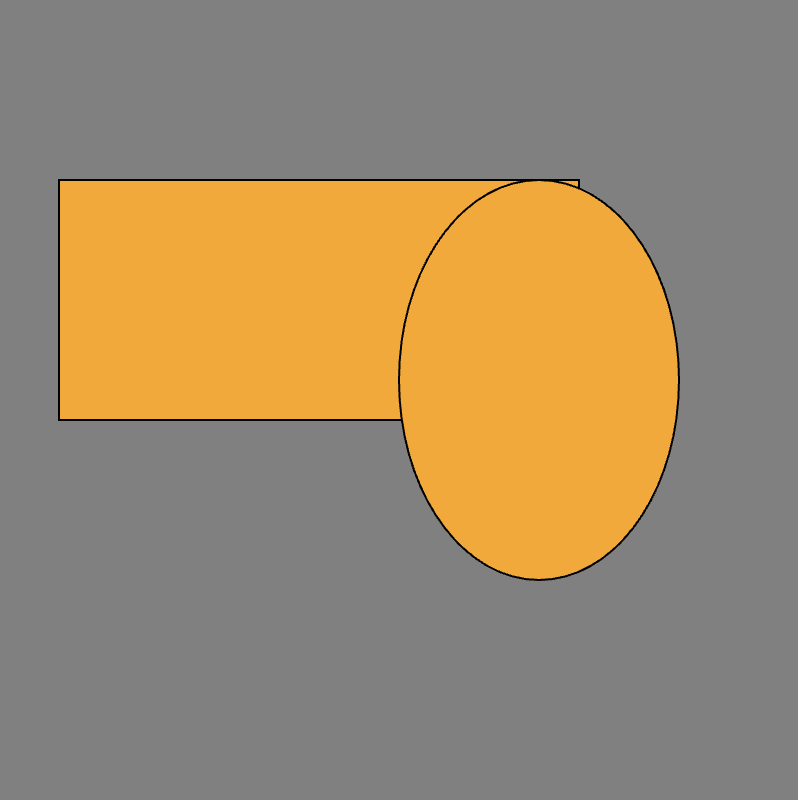
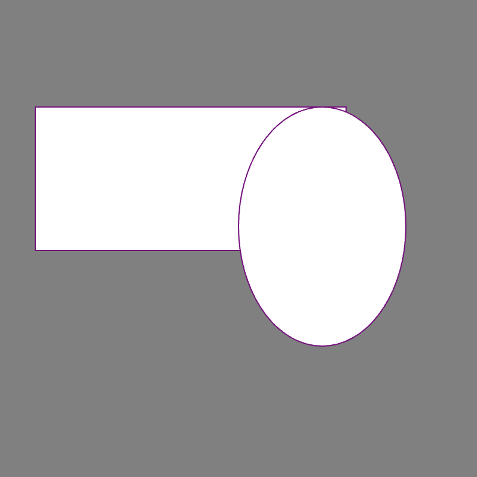
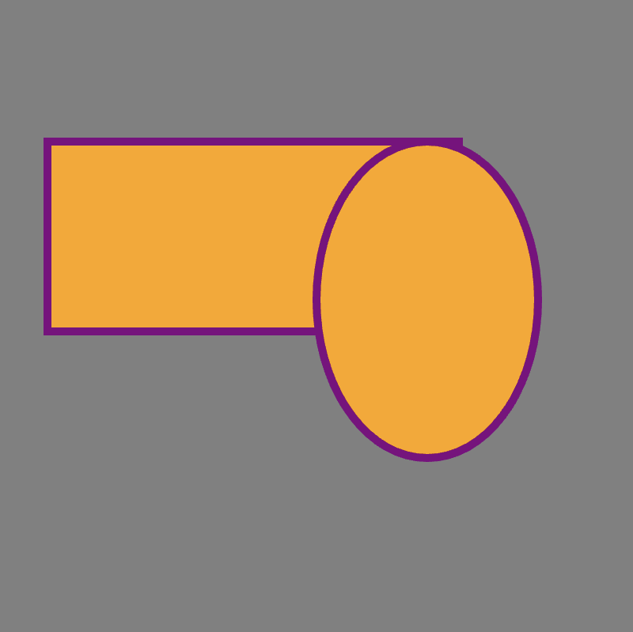

# Link to video.

### The `fill()` Function 

By default, the inside of a shape is white. To change the inside colour of a shape, we use the `fill()` function. This tells the program that the inside of *all the shapes* from now on will be this colour.

```js
function setup() {
    createCanvas(400, 400);
    background(128);
  
    fill(255, 165, 0); // makes the inside orange

    rect(30, 90, 260, 120); // rectangle
    ellipse(270, 190, 140, 200); // ellipse
}
```



### The `stroke()` Function

By default, the outline of a shape is black. To change the outline colour of a shape, we use the `stroke()` function. This tells the program that the outline of *all the shapes* from now on will be this colour.

```js
function setup() {
    createCanvas(400, 400);
    background(128);
  
    stroke(128, 0, 128); // makes the outlines purple

    rect(30, 90, 260, 120); // rectangle
    ellipse(270, 190, 140, 200); // ellipse
}
```



### The `strokeWeight()` Function

By default, the outline of a shape is one pixel wide. If we want the outline of a shape to be thicker, we can use the `strokeWeight()` function. The parameter is the number of pixels.

```js
function setup() {
    createCanvas(400, 400);
    background(128);

    fill(255, 165, 0); // makes the inside orange
    stroke(128, 0, 128); // makes the outlines purple

    strokeWeight(5); // makes the outline of all shapes 5 pixels wide

    rect(30, 90, 260, 120); // rectangle
    ellipse(270, 190, 140, 200); // ellipse
}
```


