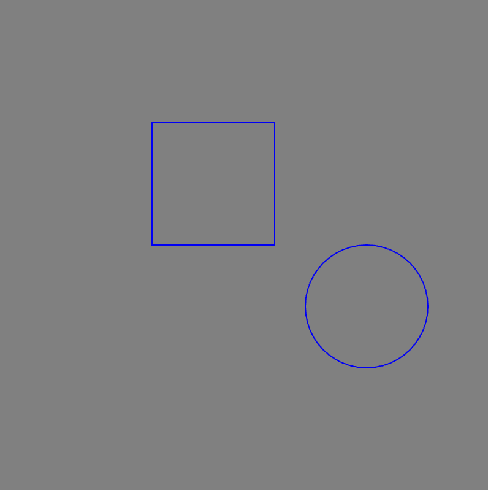
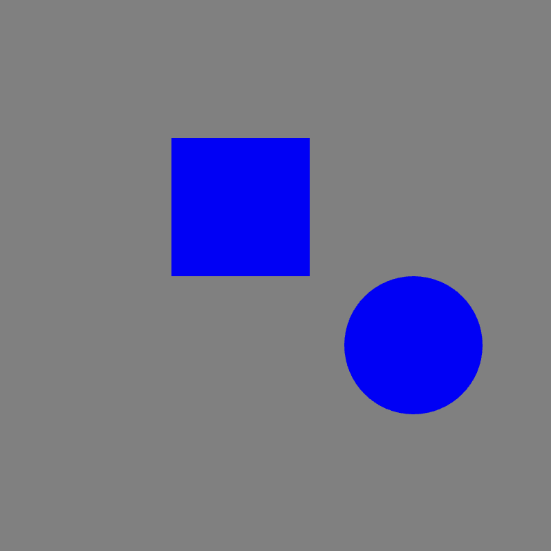

# Link to video.

### The `noFill()` Function

If we want the inside of a shape to be transparent, we can use `noFill()`.

```js
function setup() {
    createCanvas(400, 400);
    background(128);

    stroke(0, 0, 255); // makes the outline blue
    noFill(); // makes all the insides transparent
    rect(125, 100, 100);
    ellipse(300, 250, 100);
}
```



### The `noStroke()` Function

If we want the outline of a shape to be transparent, we can use `noStroke()`.

```javascript
function setup() {
    createCanvas(400, 400);
    background(128);

    fill(0, 0, 255); // makes the insides blue
    noStroke(); // makes all the outlines transparent
    rect(125, 100, 100);
    ellipse(300, 250, 100);
```


