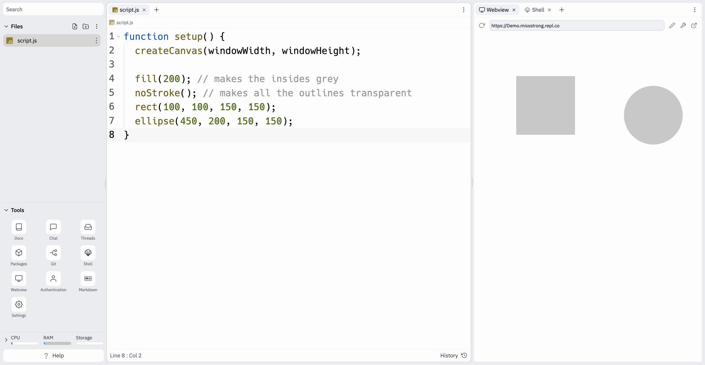
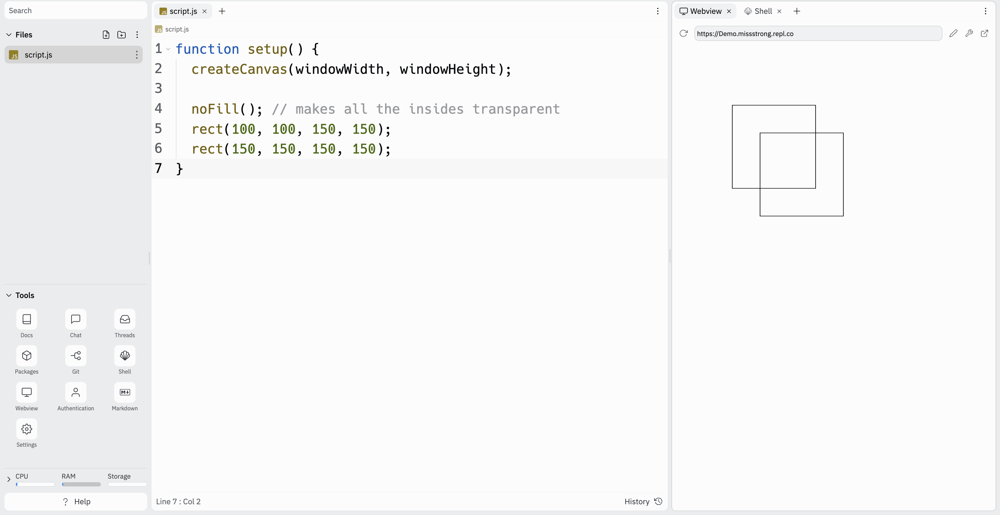

# Link to video.

### The `noStroke()` Function

If we want the outline of a shape to be transparent, we can use `noStroke()`.

```javascript
function setup() {
  createCanvas(windowWidth, windowHeight);

  fill(200); // makes the insides grey
  noStroke(); // makes all the outlines transparent
  rect(100, 100, 150, 150);
  ellipse(450, 200, 150, 150);
}
```



### The `noFill()` Function

If we want the inside of a shape to be transparent, we can use `noFill()`.

```js
function setup() {
  createCanvas(windowWidth, windowHeight);

  noFill(); // makes all the insides transparent
  rect(100, 100, 150, 150);
  rect(150, 150, 150, 150);
}
```


