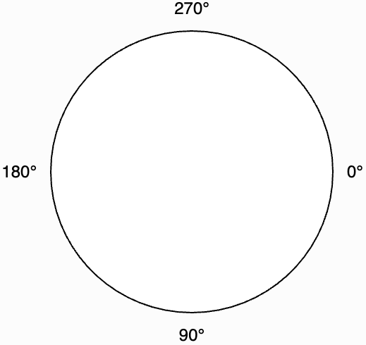
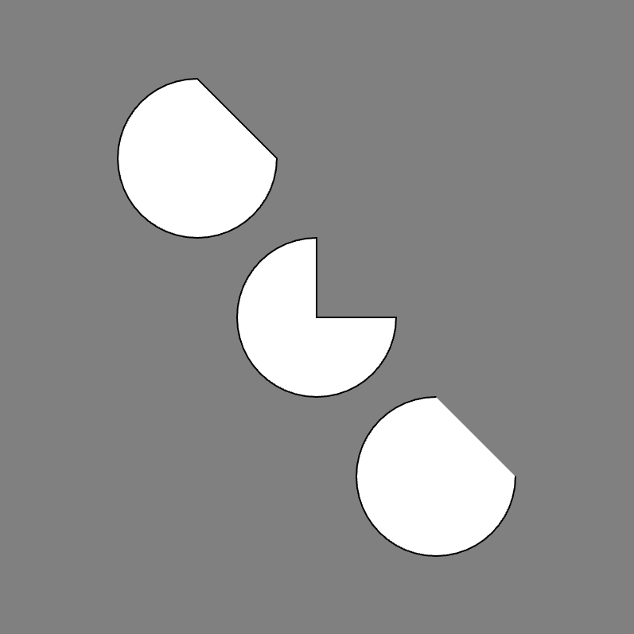

# [Link to video.](https://www.youtube.com/watch?v=73LGvA1G0tQ&list=PLVD25niNi0BkHx4xw7IW9oDaq5V0wJF7V)

### The `arc()` Function

An **arc** is a curve along the circumference of a circle. We use the `arc()` function to draw arcs. This function needs the same four parameters as `ellipse()`, but it also needs two or three more: the starting point, the ending point, and an optional mode. 

By default, the starting and ending points are written in **radians**. Radians are a unit used to measure the size of an angle, just like degrees. Radians usually aren't taught until Grade 12 Advanced Functions, so it'll be easier for us to use degrees. To use degrees instead, call `angleMode(DEGREES)`. If we want to change it back to radians, we can call `angleMode(RADIANS)`.

Here are a few significant points of an ellipse:

*  0° is the right-most point
*  90° or -270° is is the bottom-most point
*  180° is the left-most point
*  270° or -90°  is the top-most point



There are three modes for the arc:

* `OPEN` (the default mode, there is no line drawn from the start and end point)
* `CHORD` (a line is drawn from the start and end point)
* `PIE` (it looks like a pie)

If we don't specify the mode, it will default to `OPEN`.

```javascript
function setup() {
    createCanvas(400, 400);
    background(128);

    angleMode(DEGREES);
    arc(125, 100, 100, 100, 0, 270, CHORD); // chord arc
    arc(200, 200, 100, 100, 0, 270, PIE); // pie arc
    arc(275, 300, 100, 100, 0, 270, OPEN); // open arc
}
```


