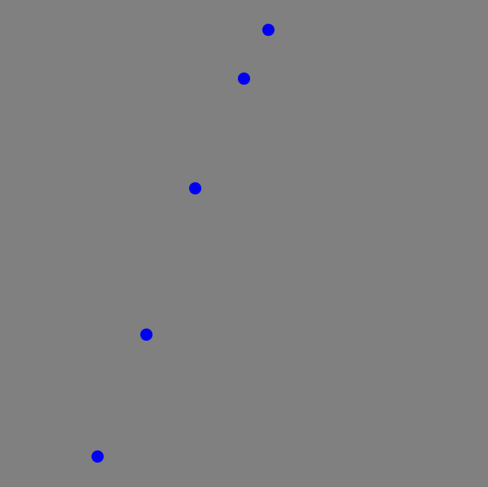
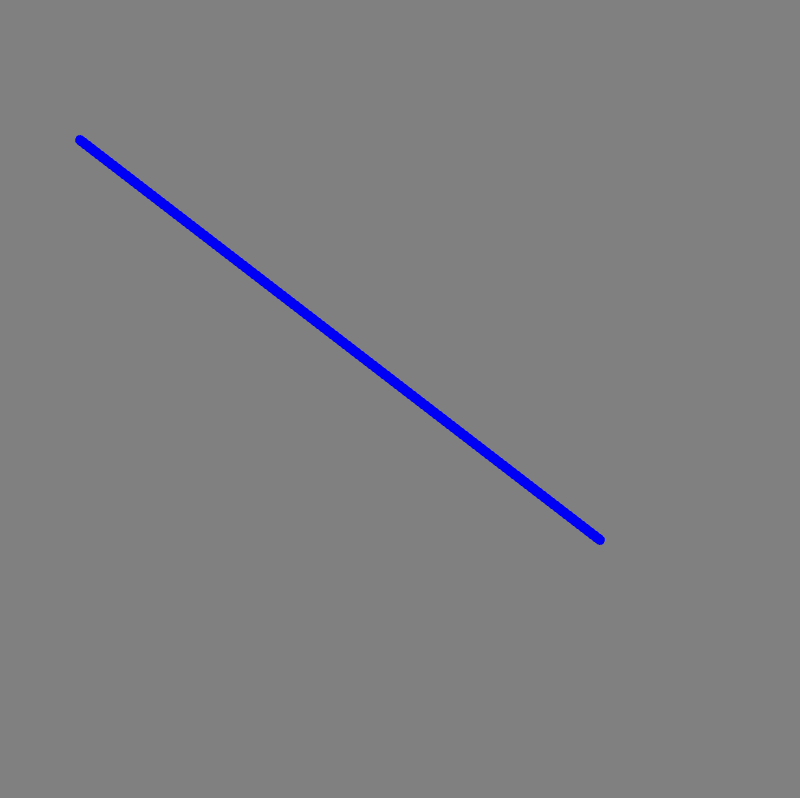

# [Link to video.](https://www.youtube.com/watch?v=apNkvngR4ok&list=PLVD25niNi0BkHx4xw7IW9oDaq5V0wJF7V)

### The `point()` Function

The `point()` function draws a point. It takes two parameters: the *x* and *y* coordinates of the point. We can modify the thickness of the point with `strokeWeight()` and the colour of the point with `stroke()`.

```javascript
function setup() {
    createCanvas(400, 400);
    background(128);

    strokeWeight(10); // makes every point 10 pixels thick
    stroke(0, 0, 255); // makes every point blue
    point(80, 375);
    point(120, 275);
    point(160, 155);
    point(200, 65);
    point(220, 25);
}
```



### The `line()` Function

The `line()` function draws a line from one point to another point. It takes four parameters: the *x* and *y* coordinates of the first point and the *x* and *y* coordinates of the second point. We can modify the thickness of the line with `strokeWeight()` and the colour of the line with `stroke()`.

```javascript
function setup() {
    createCanvas(400, 400);
    background(128);

    strokeWeight(5);
    stroke(0, 0, 255);
    line(40, 70, 300, 270);
}
```


