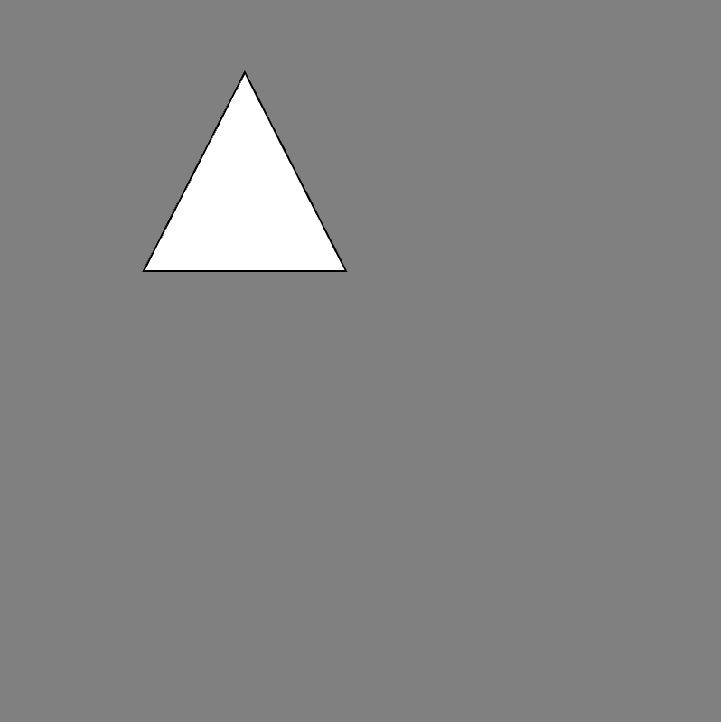
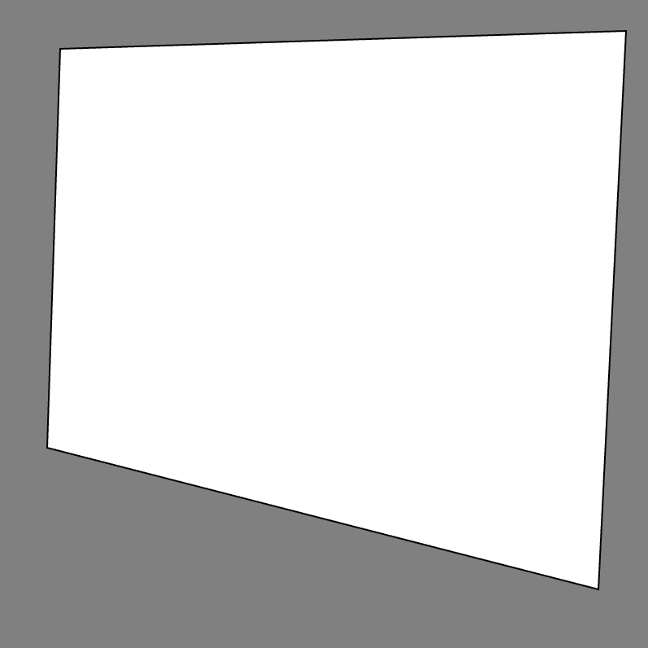

# [Link to video.](https://www.youtube.com/watch?v=hfIUZZB-5YQ&list=PLVD25niNi0BkHx4xw7IW9oDaq5V0wJF7V)

### The `triangle()` Function

The `triangle()` function draws a triangle using three points representing the corners of the triangle. It takes six parameters: the *x* and *y* coordinates of each point.

```javascript
function setup() {
    createCanvas(400, 400);
    background(128);

    triangle(80, 150, 136, 40, 192, 150);
}
```



### The `quad()` Function

The `quad()` function draws a quadrilateral (a four-sided shape) using four points representing the four corners of the quadrilateral. It takes eight parameters: the *x* and *y* coordinates of each point.

```javascript
function setup() {
    createCanvas(400, 400);
    background(128);

    quad(38, 31, 386, 20, 369, 363, 30, 276);
}
```


