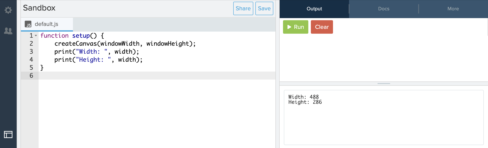
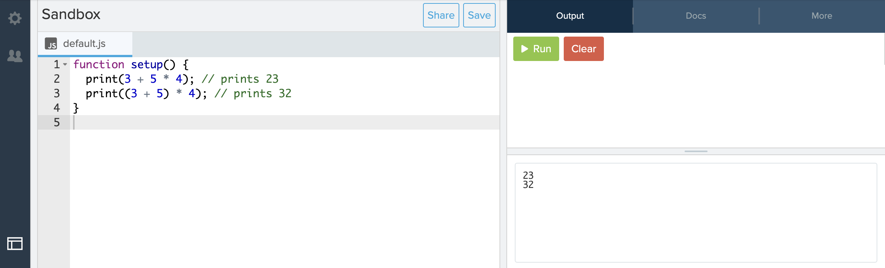

# Link to video.

### The print() Function

The `print()` function writes information in the **console**.


This is useful for letting us see what values our variables are storing.

```js
function setup() {
    createCanvas(windowWidth, windowHeight);
    print("Width: ", width);
    print("Height: ", height);
}

```



### Strings

**Strings** are used to represent text and are enclosed in double quotation marks `"` or single quotation marks `'`. 

### Arithmetic Operators

**Operators** are symbols that perform an operation. Here are the ones we can use for arithmetic:

* Addition operator: `+`
* Subtraction operator: `-`
* Multiplication operator: `*`
* Division operator: `/`
* Exponent operator: `**` (*not* `^`)

### Order of Operations

The order of operations for arithmetic operators is BEDMAS. 

```js
function setup() {
    print(3 + 5 * 4); // prints 23
    print((3 + 5) * 4); // prints 32
}
```


