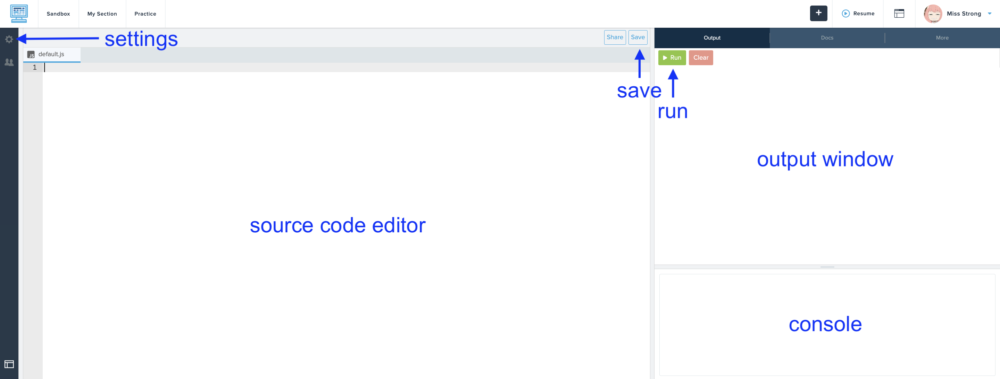
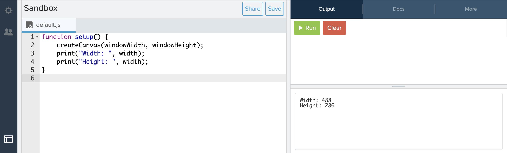

# [Link to video.](https://www.youtube.com/watch?v=mkatvLq8Res&list=PLVD25niNi0BkHx4xw7IW9oDaq5V0wJF7V)


### The print() Function

The `print()` function writes information in the **console**.



This is useful for letting us see what values our variables are storing.

```js
function setup() {
    createCanvas(windowWidth, windowHeight);
    print("Width: ", width);
    print("Height: ", height);
}

```



When you see text enclosed indouble quotation marks `"` or single quotation marks `'`, that's called a **string**

We can also combine strings with numbers using the `+` operator.

```js
function setup() {
    createCanvas(windowWidth, windowHeight);
    print("Width: " + width);
    print("Height: " + height);
}

```
