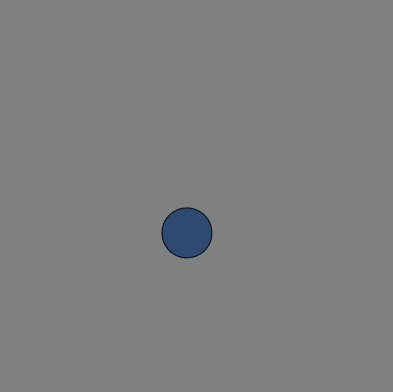

# [Link to video.](https://www.youtube.com/watch?v=jinT2GJxROc&list=PLVD25niNi0BkHx4xw7IW9oDaq5V0wJF7V)

### Random Number Generator

**RNG** stands for **random number generator**. In P5.js, we have a function called `random()` that generates pseudorandom (i.e. almost perfectly random) decimal numbers within a specified range. For example `random(50)` generates a random decimal number between 0 and 49.99999999999999 (yes, there are exactly 14 decimal places).

We can use this to generate random colours. The program below has a circle following the cursor where the circle constantly changes colours.

```js
function setup() {
    createCanvas(400, 400);
    background(128);
}

function draw() {
    fill(random(255), random(255), random(255)); // the RGB values are random
    ellipse(mouseX, mouseY, 50);
}
```


### Frame Rate

We may not want 60 colours flashing at us every second, so now would be a good time to use the `frameRate()` function. We can use this to change the frame rate from 60 frames per second to another number of frames. If we put a number higher than 60, it will just treat it as 60 since that's as high as the frame rate can go.

```js
function setup() {
    createCanvas(400, 400);
    background(128);
    frameRate(10); // the frame rate is now 10 frames per second instead of 60
}

function draw() {
    fill(random(256), random(256), random(256)); // the RGB values are random
    ellipse(mouseX, mouseY, 50);
}
```


We can also generate random locations for shapes. Here is an example of a program that continuously draws colourful circles in various locations on the canvas.

```js
function setup() {
    createCanvas(400, 400);
    background(128);
    frameRate(2); // the frame rate is now 2 frames per second instead of 60
}

function draw() {
    fill(random(256), random(256), random(256)); // the RGB values are random
    ellipse(random(width), random(height), 50);
}
```




### Range of Random Numbers

If we want to generate a random number between two values, put both values as paramaters of `random()`. For example, `random(127, 256)` generates a random number between 127 and 255.99999999999999.
