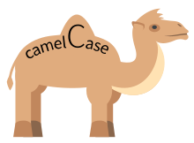
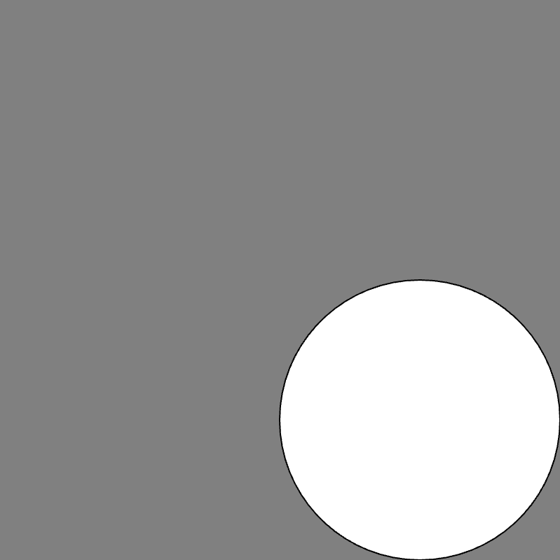

# Link to video.

### Built-In Variables 

We've come across the following **built-in variables**. They are built into P5.js.

* `mouseX` and `mouseY`
* `pmouseX` and `pmouseY`
* `windowWidth ` and `windowHeight`
* `width` and `height`

However, we can make our own **custom variables** too. Custom variables need to be **declared** (i.e. given a name) and **assigned a value**. 

### Variable Declaration

When we declare a custom variable, we have to give it a name. Ideally, the name is a descriptive word or a few descriptive words. 

In JavaScript, the convention is to name variables using **lower camel case**. If the name is just one word, it is all lowercase. If the name is multiple words, the first word is all lower case and all other words are lower case except for the first letter. The idea is that the capital letters look like humps on a camel: `thisIsLowerCamelCase` and `ThisIsUpperCamelCase`. All built-in variables and functions follow this convention.



### Variable Assignment

We assign a value to a custom variable by using the **assignment operator** `=`. It looks like an equal sign, but it's not checking for equality (i.e. it's *not* a left side vs. right side check). It takes a value and stores it into the variable.

```javascript
function setup() {
    createCanvas(400, 400);
    background(128);
    x = 300; // declaring a variable named x and giving it the value of 300
    ellipse(x, x, 200); // a circle centered at (300, 300) is drawn
}
```


When we declare and assign a value to a custom variable, we must put the name on the left side of `=` and the value on the right side. If we swap the sides, it won't work.

```javascript
function setup() {
    createCanvas(400, 400);
    background(128);
    300 = x; // // this doesn't work; the program will crash
    ellipse(x, x, 200); // a circle centered at (300, 300) is drawn
}
```


