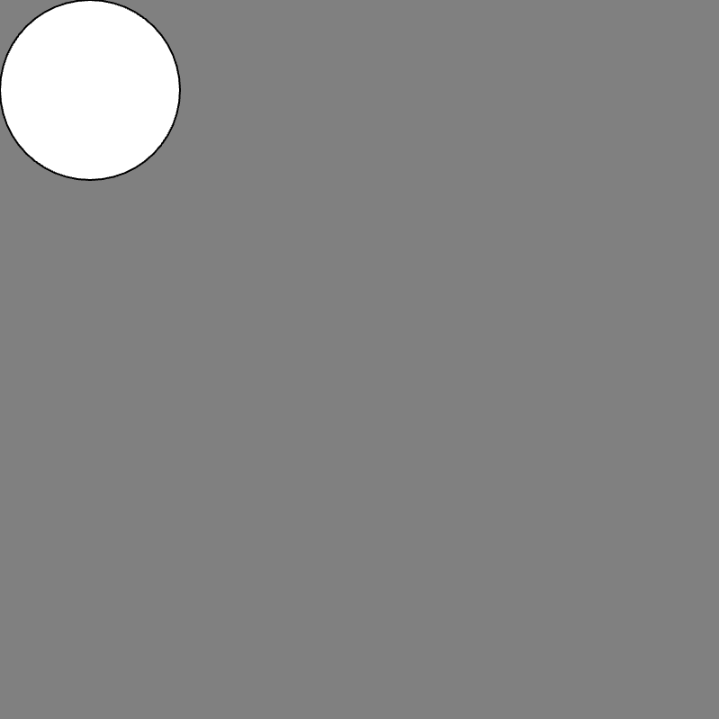
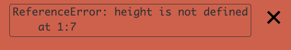

# Link to video.

### Scope

**Scope** refers to the places within a program where a variable can be accessed. A **local variable** only works in specific sections whereas a **global variable** works throughout the entire program. In JavaScript, variables can have:
* **block scope**: a local variable that only works in a section enclosed in curly braces `{}` or the entire program if there are no curly braces anywhere
* **function scope**: a local varible that only works inside a function
* **global scope**: a global variable that works throughout the entire program.

A **keyword** is a reserved word that has a special purpose. The keyword for declaring a variable with block scope is `let`. When we declare a variable using `let`, that variable can only be used within the same block after it's declared. 

```javascript
function setup() {
    createCanvas(400, 400);
    background(128);
    let size = 100; // declaring a local variable
    ellipse(50, 50, size); // a circle centered at (300, 300) is drawn
}
```



If we try to use a variable before we declare it using `let`, the program will crash. The error message will say **Reference Error**.

```javascript
function setup() {
    createCanvas(400, 400);
    background(128);
    ellipse(50, 50, size); // this doesn't work since size hasn't been declared yet
    let size = 100; // declaring a local variable
}
```


### `let` versus `var`

The keyword `let` was added to JavaScript in 2015. Prior to that, `var` was used for all local variables depite it having function scope (not quite the same thing as block scope).

An interesting result of using function scope is that we can use variable before we declare them. However, this is usually undesired behaviour (if we wanted to use the variable earlier, we would just declare them earlier). If you're curious about how this works, it's because `var` variables are **hoisted** (you can look up what this means if you're interested).

```js
function setup() {
    createCanvas(400, 400);
    background(128);
    ellipse(50, 50, size); // this actually works
    var size = 100; // declaring a local variable
}
```

### Conventions

Whenever we have a global variable that is assigned a value later in the program, it's good practice to declare it at the top of the file to make our program more easily readable.

```javascript
let coordinate; // declaring a global variable but not assigning a value to it yet

function setup() {
    createCanvas(400, 400);
    background(128);
    size = 300; // assigning a value to the global variable from before
}

function draw() {
    ellipse(50, 50, size); // this works
}
```


However, we can't just put anything we want at the very top of the file. For example, we can only call P5.js functions from within other P5.js functions such as `setup()` and `draw()`.

```javascript
print(height); // this doesn't work

function setup() {
    createCanvas(400, 400);
}
```


