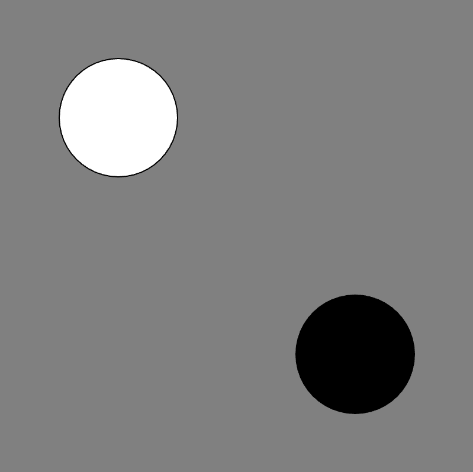

# [Link to video.](https://www.youtube.com/watch?v=hNYZYGMG_AE&list=PLVD25niNi0BkHx4xw7IW9oDaq5V0wJF7V)

### Updating Variables

The values of variables can vary, hence the name *vary-able*. We can change the value of a custom variable at any point.

When we are updating a variable, we do not repeat `let` or `var`. We only use these keywords when we are first declaring a variable.

```javascript
let x = 100; // declares the variable x and assigns it a value of 100

function setup() {
    createCanvas(400, 400);
    background(128);

    fill(255); // white fill
    ellipse(x, x, 100); 

    x = 300; // changes x to 300
    fill(0); // black fill
    ellipse(x, x, 100); 
}
```



Notice that `ellipse(x, x, 100);` was called twice but since `x` changed values, it drew the circles in different locations.

When we update variables, we can write an expression instead of a number. For example, if we want `x` to be 200 more than its previous value, we can use the expression `x + 200`.

The program below gives the same output as the example above.

```javascript
let x = 100; // declares the variable x and it assigns a value of 100

function setup() {
    createCanvas(400, 400);
    background(128);

    fill(255); // white fill
    ellipse(x, x, 100); 

    x = x + 200; // changes x to be 200 more than before
    fill(0); // black fill
    ellipse(x, x, 100); 
}
```


If we update a variable in `draw()`, we can repeatedly change its value.

```javascript
let x = 0; // declares the variable x and assigns it a value of 0

function setup() {
    createCanvas(400, 400);
    background(128);
    frameRate(5);
}

function draw() {
    ellipse(x, x, 100); 
    x = x + 50; // changes x to be 50 more than before
}
```

When we run this program, we can see each circle being drawn one by one.


### Increment Operators

**Increment operators** are used to change the value of a custom variable by adding, subtracting, multiplying, or dividing from its previous value.

| Operator | Example | New Value of `x`|
| -- | -- | -- |
| `+=` | `x += 7;` | Adds 7 to the value of `x`.<br><br/>Essentially equivalent to `x = x + 7;`. |
| `-=` | `x -= 2;` | Subtracts 2 from the value of `x`.<br><br/>Essentially equivalent to `x = x - 2;`. |
| `*=` | `x *= 2;` | Multiplies the value of `x` by 2<br><br/> Essentially equivalent to `x = x * 2;`. |
| `/=` | `x /= 2;` | Divides the value of `x` by 2 then takes the dividend.<br><br/>Essentially equivalent to `x = x / 2`;. |
| `++` | `x++;` | Adds 1 to the value of `x`.<br><br/>Essentially equivalent to `x = x + 1;` and `x += 1;`. |
| `--` | `x--;` | Subtracts 1 from the value of `x`.<br><br/>Essentially equivalent to `x = x - 1;` and `x -= 1;`. |

Let's modify the previous example using an increment operator. We can change `x = x + 50` to `x += 50` and the program would do the exact same thing. 

```javascript
let x = 0; // declares the variable x and assigns it a value of 0

function setup() {
    createCanvas(400, 400);
    background(128);
    frameRate(5);
}

function draw() {
    ellipse(x, x, 100); 
    x = x + 50; // changes x to be 50 more than before
}
```


