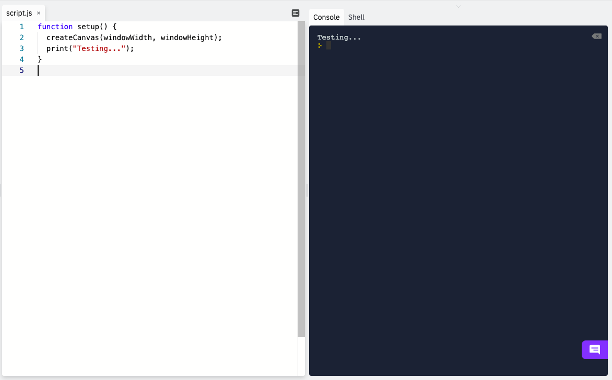
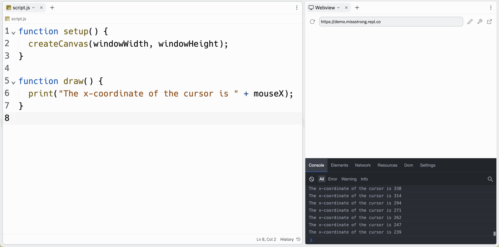

### Strings

**Strings** are used to represent text and are enclosed in double quotation marks `"` or single quotation marks `'`. 

We can use strings to print text to the console.

```js
function setup() {
  createCanvas(windowWidth, windowHeight);
  print("Testing...");
}
```


We can **concatenate** (i.e. combine) strings with numbers and other strings by using the `+` operator.

```js
function setup() {
  createCanvas(windowWidth, windowHeight);
}

function draw() {
  print("The x-coordinate of the cursor is " + mouseX);
}
```


