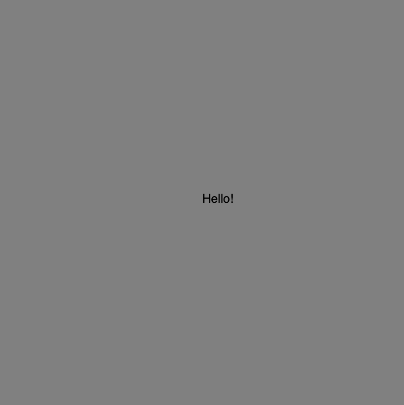
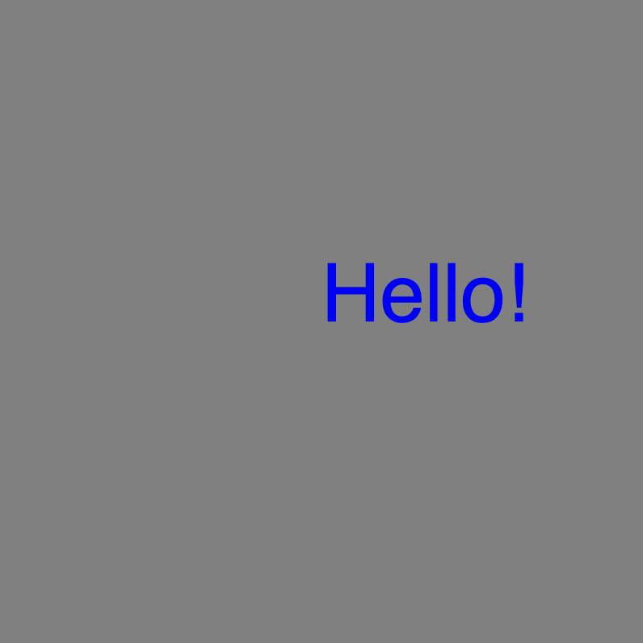
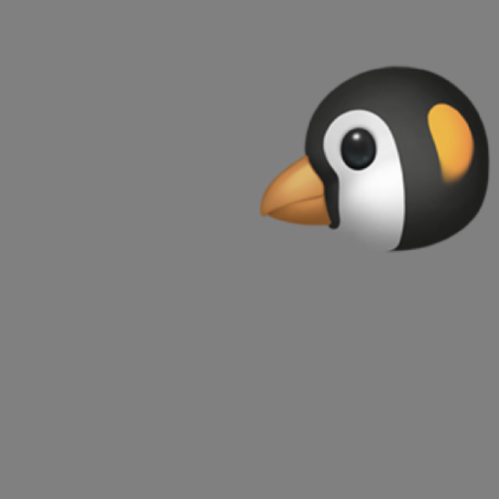
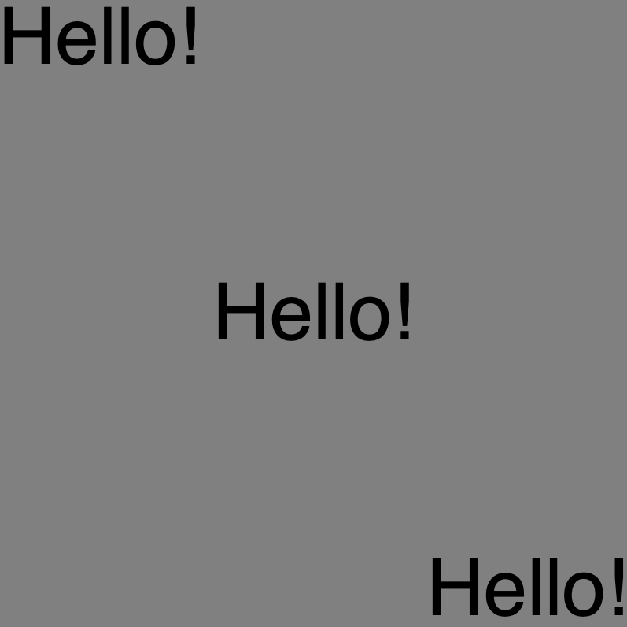

# Link to video.

### Text

We can put text on the canvas using the `text()` function. The `text()` function takes three parameters: the string, the x-coordinate, and the y-coordinate.

```javascript
function setup() {
    createCanvas(400, 400);
    background(128);

    text("Hello!", width/2, height/2);
}
```



### Colour and Size

We change the colour using `fill()` and make the font smaller or bigger using `textSize()`.

```javascript
function setup() {
    createCanvas(400, 400);
    background(128);

    fill(0, 0, 255); // makes the text blue
    textSize(50); // makes the font size 100

    text("Hello!", width/2, height/2);
}
```



### Emojis

Any character that can be typed on a keyboard can be put into a string. This includes emojis!

```javascript
function setup() {
    createCanvas(400, 400);
    background(128);
    textSize(200);
    text("🐧", width/2, height/2);
}
```


### Alignment

By default, the coordinate is the bottom-left corner of the text.

We can align the text using `textAlign()` and the following constants:
  * `CENTER`
  * `TOP`
  * `BOTTOM`
  * `LEFT`
  * `RIGHT`

```javascript
function setup() {
    createCanvas(400, 400);
    background(128);
    textSize(100);

    textAlign(LEFT, TOP);
    text("Hello!", 0, 0); // top-left

    textAlign(CENTER, CENTER);
    text("Hello!", width/2, height/2); // center

    textAlign(RIGHT, BOTTOM);
    text("Hello!", width, height); // bottom-right
}
```



### Italicizing and Bolding

We can change the font style using `textStyle()` and the following constants:
  * `NORMAL`
  * `ITALIC`
  * `BOLD`
  * `BOLDITALIC`

```javascript
function setup() {
    createCanvas(400, 400);
    background(128);

    fill(0, 0, 255); // makes the text blue
    textSize(50); // makes the font size 100

    textStyle(BOLDITALIC); // makes the text italicized and bolded
    textAlign(CENTER, CENTER); 
    text("Hello!", width/2, height/2);
}
```


