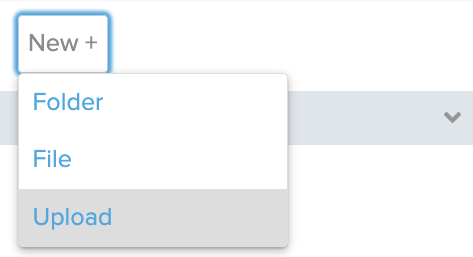
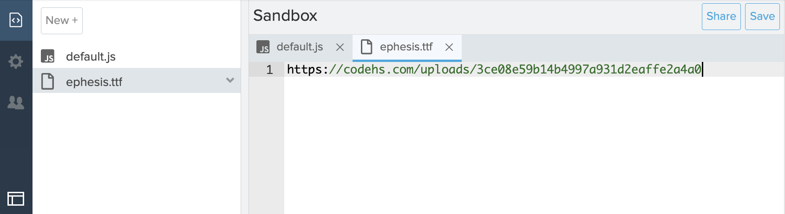

# [Link to video.](https://www.youtube.com/watch?v=mB3KiEHmdVc&list=PLVD25niNi0BkHx4xw7IW9oDaq5V0wJF7V)

### Google Fonts

We can also use any commercial-use font by uploading the **.ttf** (TrueType Font) or **.otf** (OpenType Font) file for it. We can use sites like [Google Fonts](https://fonts.google.com) to legally download these files. 

The file you download is a **.zip file**. Zip files are actually _folders_ in disguise. The TTF file is inside the folder. 


Double click on the zip file to find the TTF file. Then you can upload the TTF file into your CodeHS project. 



Instead of displaying the file, it will display a link to the file stored on CodeHS.



Then we load by calling `loadFont()` in the body of the `preload()` function. 

The `preload()` function is a function that we override, just like`setup()` and `draw()`. The `preload()` function runs only once (right befores `setup()`)and it is used to load external files smoothly. The  `setup()` function isn't called until all the files in `preload()` are done loading. 

```js
let ephesis; // we're declaring a variable that will be used later to store the font

function preload() {
    ephesis = loadFont("https://codehs.com/uploads/3ce08e59b14b4997a931d2eaffe2a4a0"); // URL for ephesis.ttf stored on CodeHS
}
```

To use the font on a specific string and set the font size, we call `textFont()` in `setup()`.

```js
let ephesis; // we're declaring a variable that will be used later to store the font

function preload() {
    ephesis = loadFont("https://codehs.com/uploads/3ce08e59b14b4997a931d2eaffe2a4a0"); // URL for ephesis.ttf stored on CodeHS
}

function setup() {
    createCanvas(400, 400);
    background(128);
    textFont(ephesis, 100); // we can put the font size here instead of using textSize()
    fill(0, 0, 255); // makes the text blue
    textStyle(ITALIC); // makes the text italicized
    textAlign(CENTER, CENTER); 
    text("Hello!", width/2, height/2);
}
```


