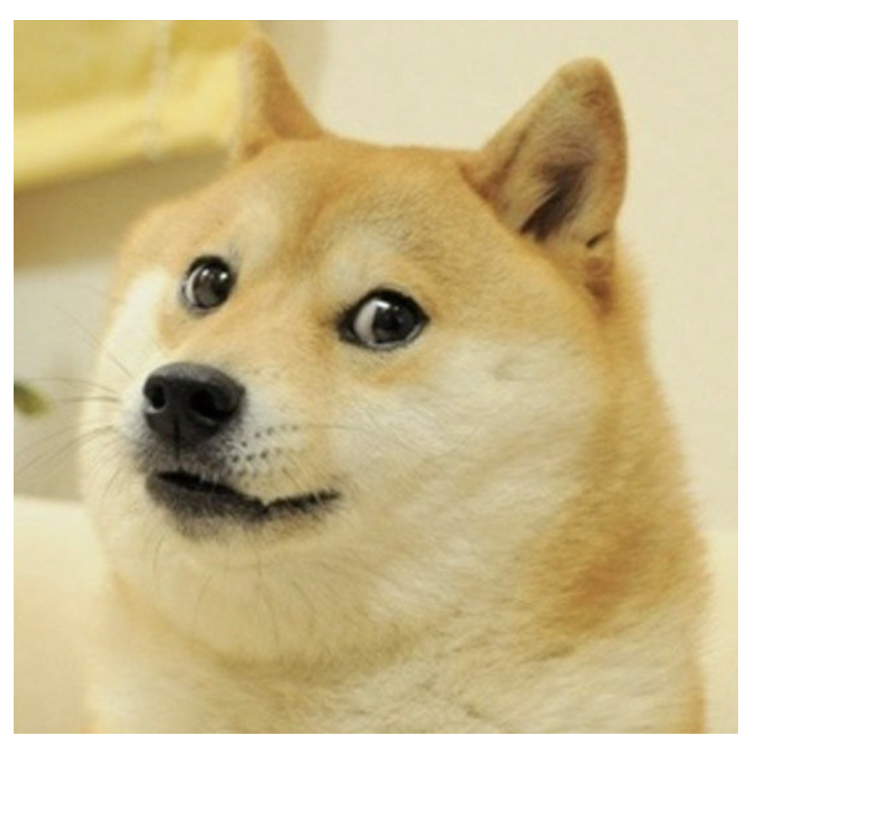

# [Link to video.](https://www.youtube.com/watch?v=Nvo884jU6GU&list=PLVD25niNi0BkHx4xw7IW9oDaq5V0wJF7V)

### Images

We can upload images to use in our programs. 


We call `loadImage()` in `preload()` and `image()` in `setup()`.

The `preload()` function is a function that we override, just like`setup()` and `draw()`. The `preload()` function runs only once (right befores `setup()`)and it is used to load external files smoothly. The  `setup()` function isn't called until all the files in `preload()` are done loading.

```js
let doge; // declaring a variable that will later hold an image file

function preload() {
    doge = loadImage("https://codehs.com/uploads/62d8eab544d31b81511d731d11ef6c00"); // the URL provided by CodeHS
}

function setup() {
    createCanvas(400, 400);
    image(doge, 0, 0); // the top-left corner of the image will be (0, 0)
}
```


By default, the coordinates we call in `image()` will be the top-left corner. If we want the coordinates to be the center of the image, we can call `imageMode(CENTER)`.

```js
let doge;

function preload() {
    doge = loadImage("https://codehs.com/uploads/62d8eab544d31b81511d731d11ef6c00"); 
}

function setup() {
    createCanvas(400, 400);
    imageMode(CENTER); // the image() function below will take the center coordinates
    image(doge, width/2, height/2); // the center of the image will be (width/2, height/2)
}
```


