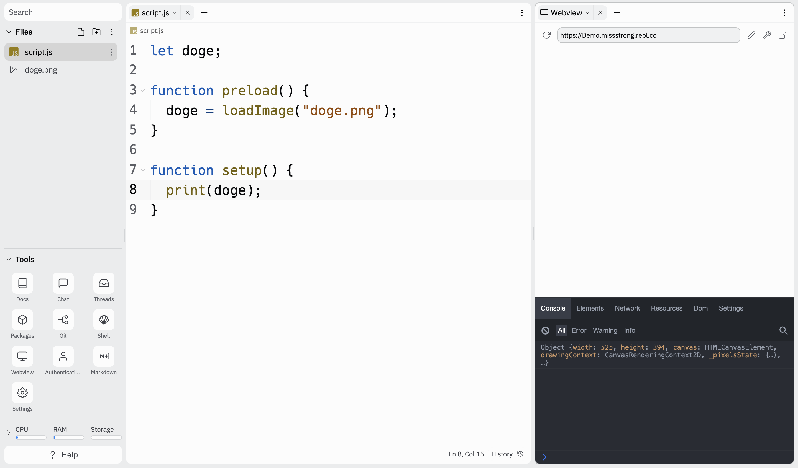
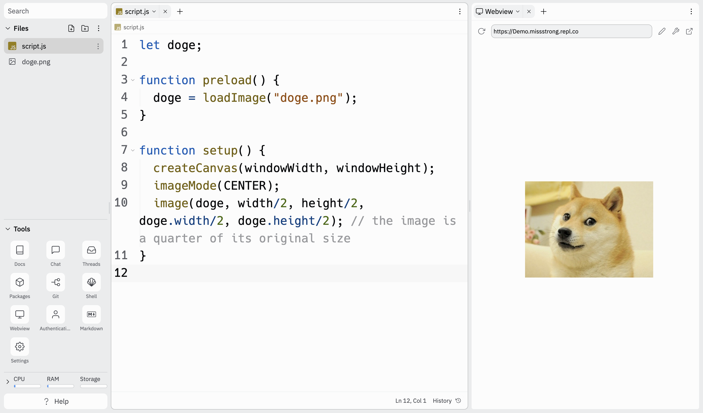

# Link to video.

### Image Objects

Here is a program we saw earlier that displays an image onto the canvas.

```js
let doge;

function preload() {
  doge = loadImage("doge.png");
}

function setup() {
  createCanvas(windowWidth, windowHeight);
  imageMode(CENTER);
  image(doge, width/2, height/2, width, height);
}
```

If we call `print(doge)` within `setup()`, here's what shows up in the console:



These are the properties of the image object.

An **object** is a data type, just like numbers, strings, and booleans. Objects contain **properties**. A property is an association between a **key** and a **value**. For example, one of the properties of `doge` is `width: 525`, where `width` is the key and `525` is the value.

### Dot Notation

We can access the properties within an object using **dot notation** (a.k.a. **dot syntax**). We write the object name followed by a dot followed by the key we want to use. This will give us the value that is associated with that key. For example, `doge.width` gives us `525`, and `doge.height` gives us `394` (since the dimensions of the image are 525 pixels by 394 pixels).

We can use `.width` and `.height` to scale the size of an image.

```js
let doge;

function preload() {
  doge = loadImage("doge.png");
}

function setup() {
  createCanvas(windowWidth, windowHeight);
  imageMode(CENTER);
  image(doge, width/2, height/2, doge.width/2, doge.height/2); // the image is a quarter of its original size
}
```



