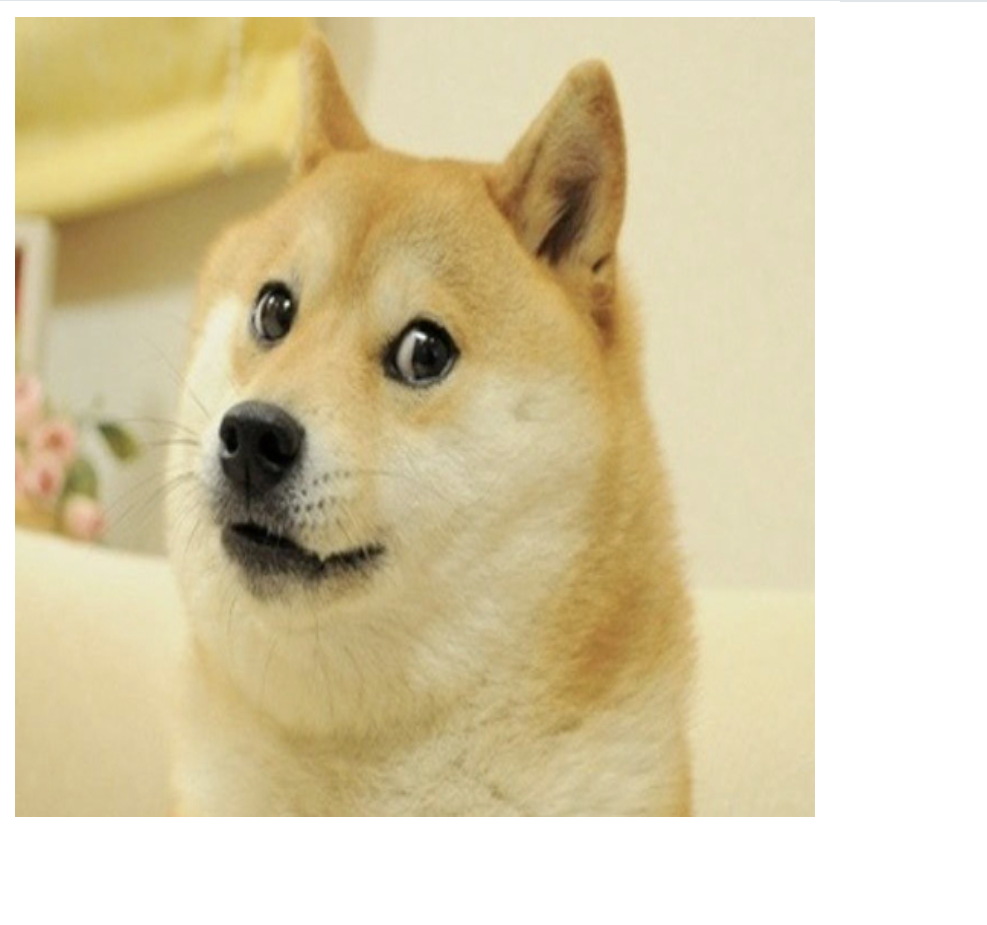
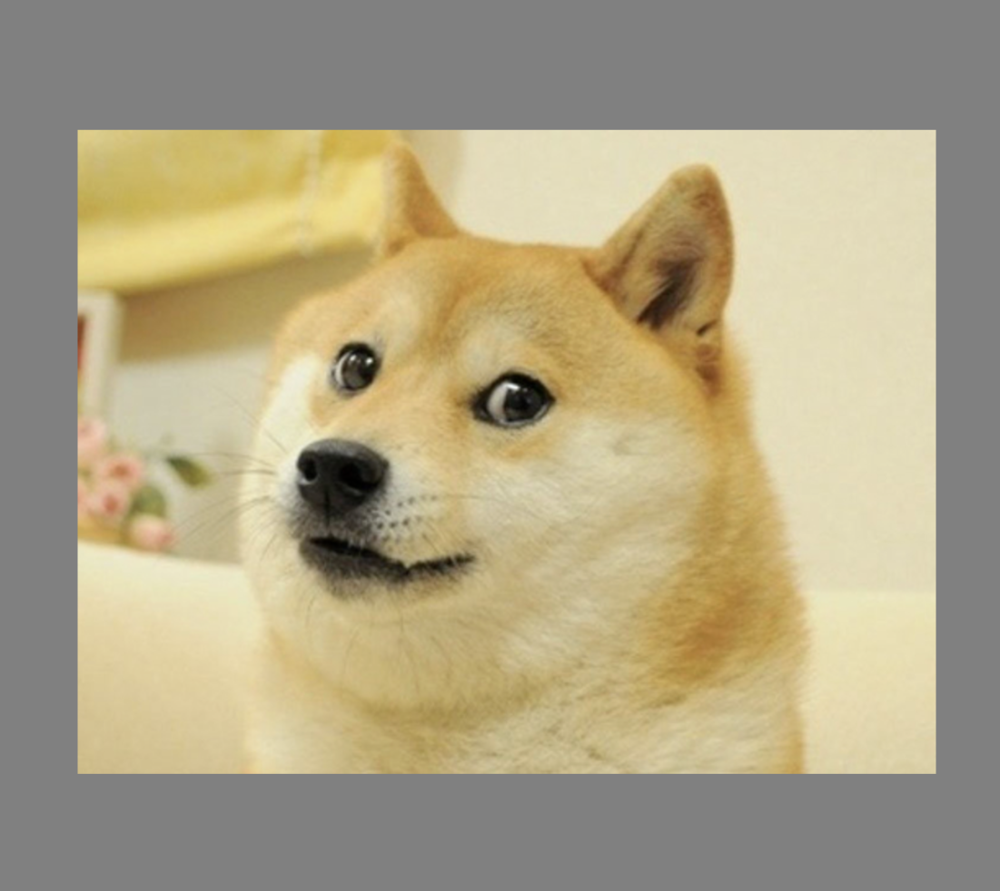
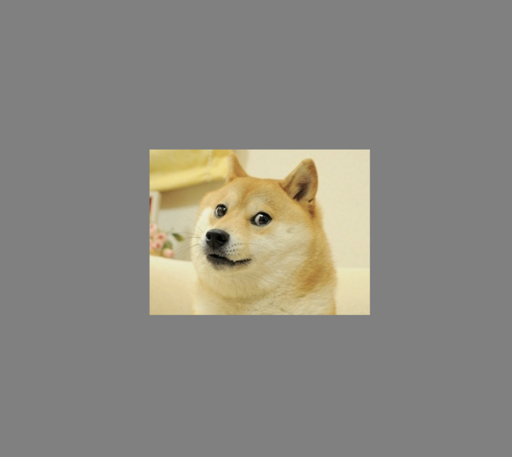

# [Link to video.](https://www.youtube.com/watch?v=rhXvo6tO2UQ&list=PLVD25niNi0BkHx4xw7IW9oDaq5V0wJF7V)

### Image Dimensions

By default, the image keeps its original dimensions. If we want to change the dimensions of the image, we can pass them as the fourth and fifth parameters in `image()`.

```js
let doge;

function preload() {
    doge = loadImage("doge.png"); 
}

function setup() {
    createCanvas(400, 400);
    image(doge, 0, 0, width, height); // takes up the entire canvas
}
```



### Dot Notation

We can access properties of the image using **dot notation** (a.k.a. **dot syntax**). For example, `doge.width` gives us `525`, and `doge.height` gives us `394` (since the dimensions of the image are 525 pixels by 394 pixels).


```js
let doge;

function preload() {
    doge = loadImage("doge.png");
}

function setup() {
    createCanvas(windowWidth, windowHeight);
    background(128);
    imageMode(CENTER);
    image(doge, width/2, height/2, doge.width, doge.height); // original size of the image
}
```



If we multiple or divide `.width` and `.height` by the same number, we'll maintain the original ratio of the image.


```js
let doge;

function preload() {
    doge = loadImage("doge.png");
}

function setup() {
    createCanvas(windowWidth, windowHeight);
    background(128);
    imageMode(CENTER);
    image(doge, width/2, height/2, doge.width/2, doge.height/2); // the image is a quarter of its original size
}
```



