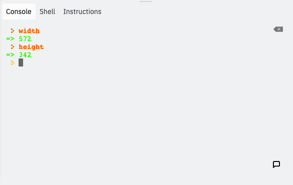

### Functions

A **function** is a set of instruction that achieves something specific. When we want these instructions to run, we **call** the function. Every function has a name and the name is followed by a set of parentheses. 

There are two types of functions in programming: **built-in functions** and **custom functions**. Built-in functions are built into the programming language whereas custom functions are functions that we create ourselves. 

### The `setup()` Function

The first built-in function we'll be looking at is the `setup()` function. The `setup()` function is automatically called once when the program is run. By default it doesn't do anything, but it is **overrideable**, meaning we can change what it does.

To override `setup()`, we write the following:

```javascript
function setup() {
  
}
```

Inside the curly braces `{}` we write the code we want to run during the setup.

### The `createCanvas()` Function

The second built-in function we'll be looking at is the `createCanvas()`. This function creates the canvas for us to draw our sketch, but before it can do that it needs to know how big to make the canvas. Whenever a function requires additional information called **parameters**, we put the values of the parameters inside the parentheses, separated by commas. These values are called **arguments**.

The `createCanvas()` function requires two parameters: the width of the canvas and the height of the canvas, in pixels.  Let's suppose we want a canvas that is 500px by 300px. We can do that with this line of code:

```javascript
createCanvas(500, 300);
```

The semicolon `;` at the end indicates the end of a **statement**. A function call is one example of a statement.

We always want to create the canvas during the setup, so we put this line in the **body** of `setup()`. The body is the space between the braces.

```javascript
function setup() {
  createCanvas(500, 300);
}
```

Notice the tab space in front of `createCanvas(500, 300);`. Whenever we write code within curly braces, each line will have one more preceding tab space compared to the line with the opening curly brace. 

### `windowWidth` and `windowHeight`

A **variable** stores a value. The value can vary, hence the name *vary-able*. The first two built-in variables we'll look at are `windowWidth` and `windowHeight`. These variables store the dimensions of the window that the canvas will go on. The values depend on the size of the browser. To create a canvas with the maximum dimensions, we can use `windowWidth` for the width of the canvas and `windowHeight` for the height of the canvas.

```javascript
function setup() {
  createCanvas(windowWidth, windowHeight);
}
```

### `width` and `height`

The next two built-in variables we'll be looking at are `width` and `height`. Once we call `createCanvas()`, these two variables store the width and height of the canvas. We can use these values throughout the rest of the program.

### The Console

The console is the window in the bottom-right corner that says "console" above it. It is used to interact with the program while it is running. Whenever we get a error, we will see a red error message there. Another way we can use it is to look up the values of variables. The `>` is a prompt for us to type something. If we write the name of a variable then press ENTER, it will print the value of that variable.


