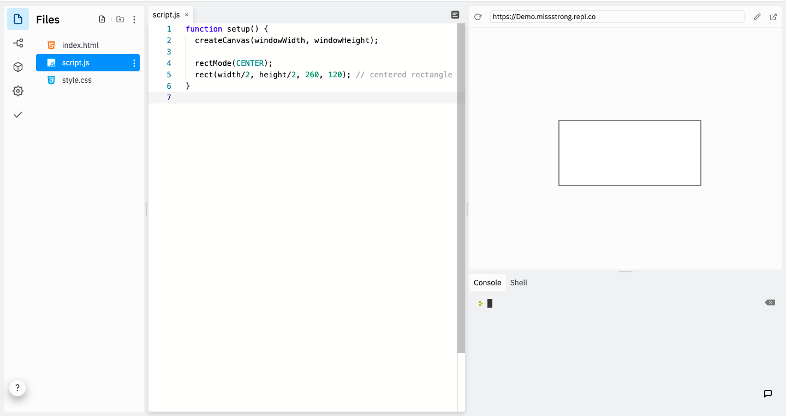
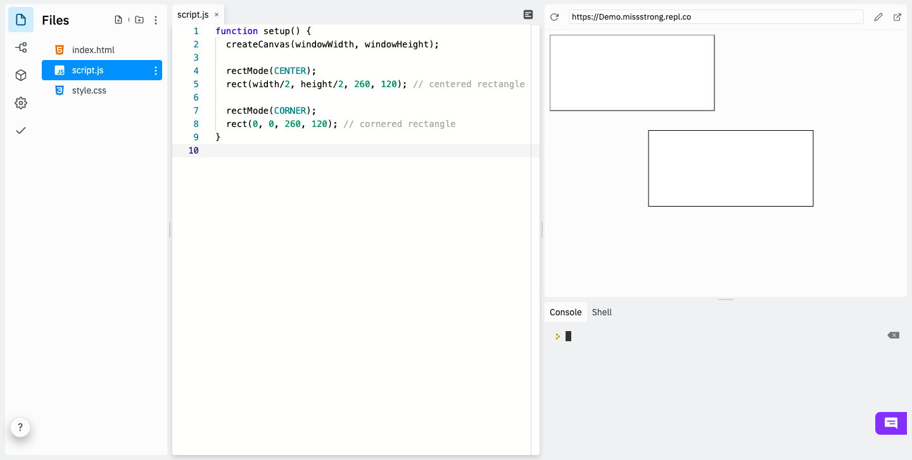

### The `rectMode()` Function

If we want to draw a rectangle based on where its center is, we can call `rectMode(CENTER)` before we call `rect()`. 

```javascript
function setup() {
  createCanvas(windowWidth, windowHeight);

  rectMode(CENTER);
  rect(width/2, height/2, 260, 120); // centered rectangle
}
```



`CENTER` is a built-in **constant**. A constant is a variable that can't change. The convention in most programming languages is to write constants in all uppercase letters.

If we want to change it back to using the top-left corner, we can call `rectMode(CORNER)`.

```javascript
function setup() {
  createCanvas(windowWidth, windowHeight);
  
  rectMode(CENTER);
  rect(width/2, height/2, 260, 120); // centered rectangle
  
  rectMode(CORNER);
  rect(0, 0, 260, 120); // cornered rectangle 
}
```



We could also create a rectangle using its top-left cordinate and its bottom-right coordinate using `rectMode(CORNERS)`.

```javascript
function setup() {
  createCanvas(windowWidth, windowHeight);
  
  rectMode(CORNERS);
  rect(50, 50, width - 50, height - 50); // rectangle based on two diagonal coordinates
}
```


