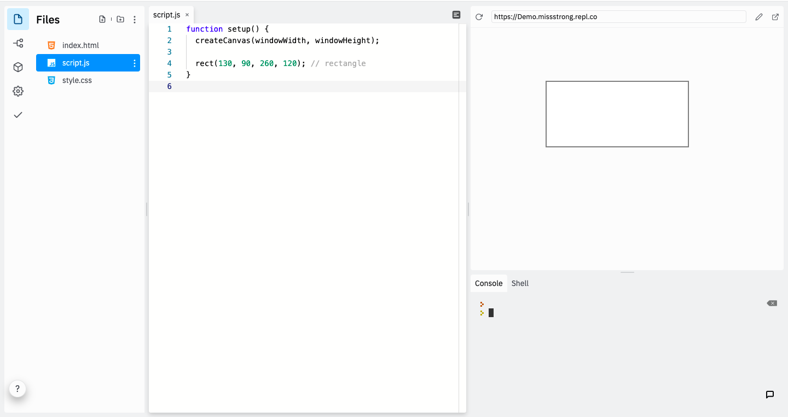

### The `rect()` Function

We use `rect()` to draw squares and rectangles. This function takes four parameter: an *x*-value, a *y*-value, a width, and a height. If the width and height are the same, it will draw a square. By default, (*x*, *y*) is the top-left vertex of the rectangle.

```javascript
function setup() {
  createCanvas(windowWidth, windowHeight);

  rect(130, 90, 260, 120); // rectangle
}
```



### The `rectMode()` Function

If we want to draw a rectangle based on where its center is, we can call `rectMode(CENTER)` before we call `rect()`. 

```javascript
function setup() {
  createCanvas(windowWidth, windowHeight);

  rectMode(CENTER);
  rect(width/2, height/2, 260, 120); // centered rectangle
}
```


`CENTER` is a built-in **constant**. A constant is a variable that can't change. The convention in most programming languages is to write constants in all uppercase letters.
