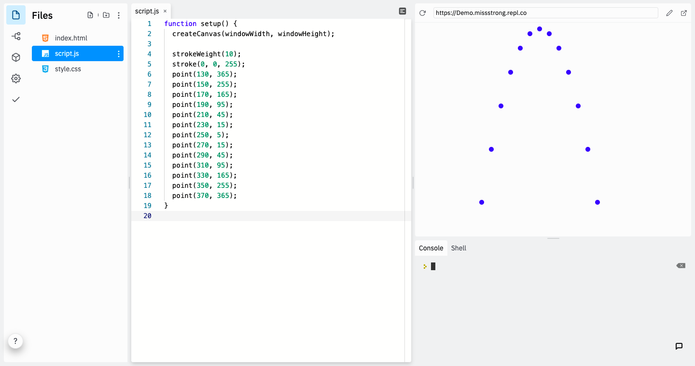
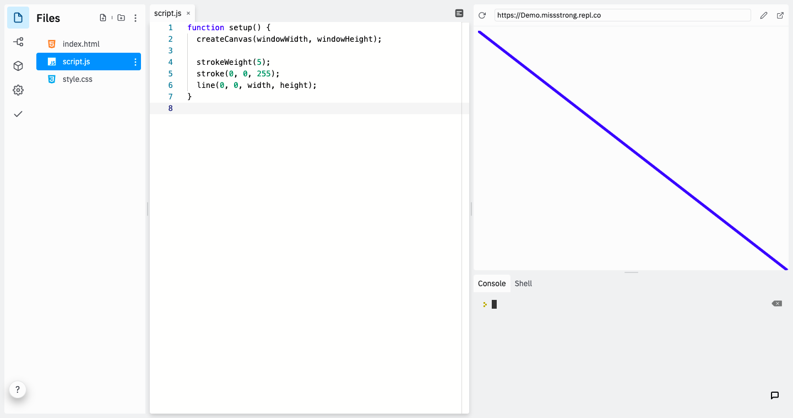
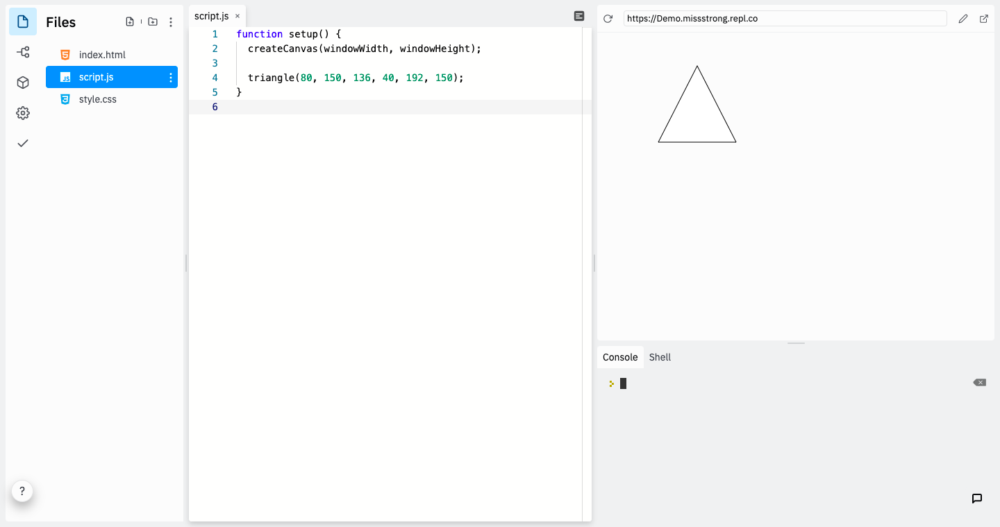
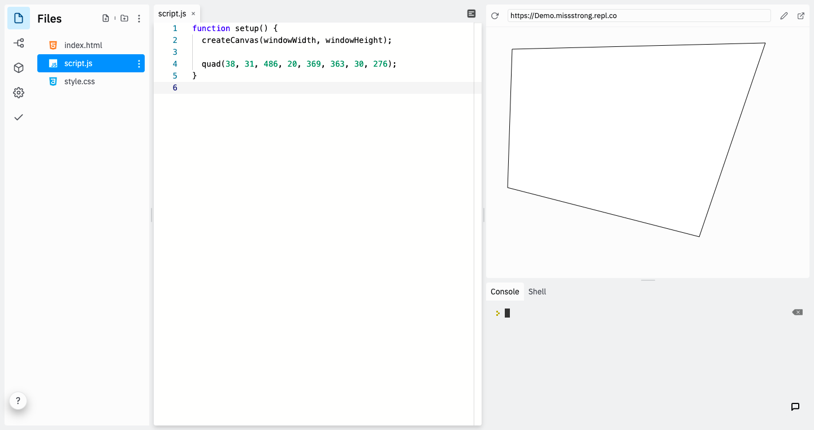

### The `point()` Function

The `point()` function draws a point. It takes two parameters: the *x* and *y* coordinates of the point. We can modify the thickness of the point with `strokeWeight()` and the colour of the point with `stroke()`.

```javascript
function setup() {
  createCanvas(windowWidth, windowHeight);

  strokeWeight(10); // makes every point 10 pixels thick
  stroke(0, 0, 255); // makes every point blue
  point(130, 365);
  point(150, 255);
  point(170, 165);
  point(190, 95);
  point(210, 45);
  point(230, 15);
  point(250, 5);
  point(270, 15);
  point(290, 45);
  point(310, 95);
  point(330, 165);
  point(350, 255);
  point(370, 365);
}
```



### The `line()` Function

The `line()` function draws a line from one point to another point. It takes four parameters: the *x* and *y* coordinates of the first point and the *x* and *y* coordinates of the second point. We can modify the thickness of the line with `strokeWeight()` and the colour of the line with `stroke()`.

```javascript
function setup() {
  createCanvas(windowWidth, windowHeight);

  strokeWeight(5);
  stroke(0, 0, 255);
  line(40, 0, width, height);
}
```



### The `triangle()` Function

The `triangle()` function draws a triangle using three points. It takes six parameters: the *x* and *y* coordinates of the first point, the *x* and *y* coordinates of the second point, and the *x* and *y* coordinates of the third point.

```javascript
function setup() {
  createCanvas(windowWidth, windowHeight);

  triangle(80, 150, 136, 40, 192, 150);
}
```



### The `quad()` Function

The `quad()` function draws a quadrilateral using four points. It takes four parameters: the *x* and *y* coordinates of the first point, the *x* and *y* coordinates of the second point, the *x* and *y* coordinates of the third point, and the *x* and *y* coordinates of the fourth point.

```javascript
function setup() {
  createCanvas(windowWidth, windowHeight);

  quad(38, 31, 486, 20, 369, 363, 30, 276);
}
```


