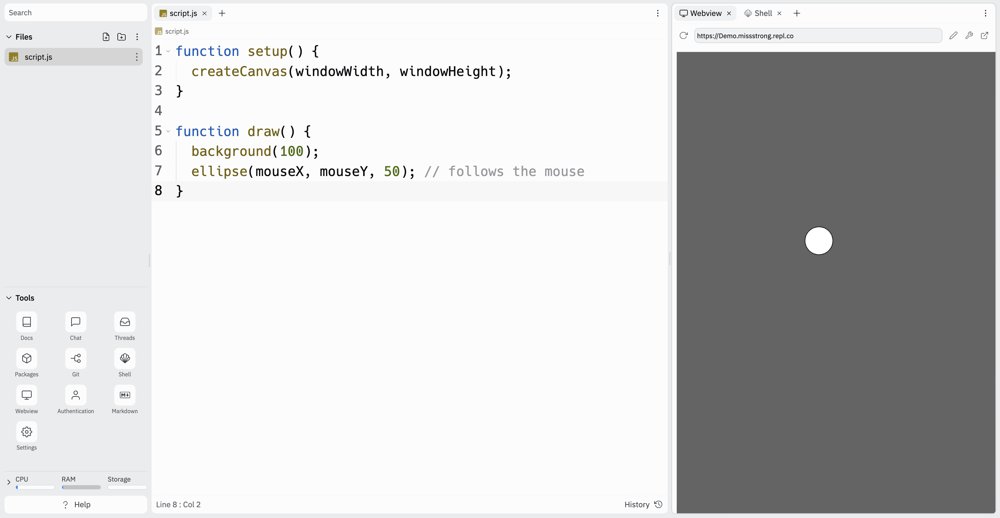

### The `draw()` Function

The `draw()` is a built-in function that is overridable. The difference between `setup()` and `draw()` is that `setup()` is called before `draw()` and `draw()` is called repeatedly at a rate of 60 times per second. 

To override `draw()`, we write the following:

```javascript
function draw() {
  
}
```

Inside the curly braces `{}` we write the code we want to run repeatedly.

### `mouseX` and `mouseY`

The `mouseX` and `mouseY` variables store the current location of your cursor. We can use them in the `draw()` function to repeatedly draw shapes following the cursor.

```javascript
function setup() {
  createCanvas(windowWidth, windowHeight);
  background(255);
}

function draw() {
  ellipse(mouseX, mouseY, 50);
}
```


If we want to modify it so that only one circle shows up at a time based on where the cursor currently is, we can move `background(100);` to the body of `draw()`.

```javascript
function setup() {
  createCanvas(windowWidth, windowHeight);
}

function draw() {
  background(100);
  ellipse(mouseX, mouseY, 50);
}
```



The reason this works is that the `draw()` function repeatedly redraws the background and covers up the previous circle. 

The reason the circle isn't flickering is that the canvas updates at the end of each cycle of `draw()`, so we see the changes to the screen all at once instead of one after the other.

### `pmouseX` and `pmouseY`

There are also built-in variables for the most recent mouse coordinates: `pmouseX` and `pmouseX` (the "p" stands for previous).

We can use this to track the movement of the mouse.

```js
function setup() {
  createCanvas(windowWidth, windowHeight);
}

function draw() {
  line(pmouseX, pmouseY, mouseX, mouseY);
}
```

This program will continuously draw a line every time the mouse moves, leaving a trail of the places the cursor has been to.


We can also use `mouseX` and `mouseY` to represent things other than coordinates, such as the length and width of a rectangle.


```js
function setup() {
  createCanvas(windowWidth, windowHeight);
}

function draw() {
  background(255);
  rectMode(CENTER);
  rect(mouseX, mouseY, mouseX/2, mouseY/2);
}
```


This will draw a rectangle with side lengths proportaional to the coordinates of its center. For example, if you move the mouse towards the origin, it will be a small rectangle and if you move it towards the bottom-right corner, it will be large rectangle.
