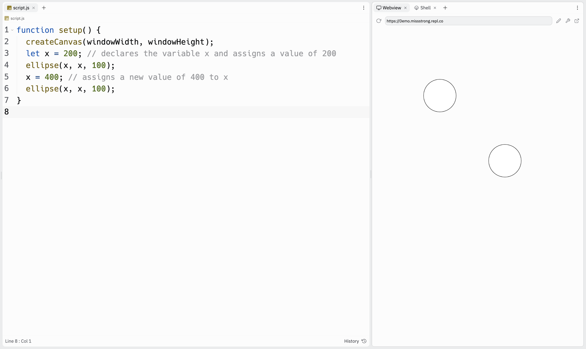

### Updating Variables

The values of variables can vary, hence the name *vary-able*. We can change the value of a custom variable at any point.

When we are updating a variable, we do not repeat `let` or `var`. We only use these keywords when we are first declaring a variable.

```javascript
function setup() {
  createCanvas(windowWidth, windowHeight);
  let coordinate = 200; // declares the variable coordinate and assign a value of 200
  ellipse(coordinate, coordinate, 100); 
  coordinate = 400; // assigns a new value of 400 to coordinate
  ellipse(coordinate, coordinate, 100); 
}
```



Notice that `ellipse(coordinate, coordinate, 100); ` was called twice but since `coordinate` changed values, it drew the circles in different locaitons.

When we update variables, we can write an expression instead of a number. For example, if we want `coordinate` to be double its previous value, we can use the expression `2 * coordinate`.

The program below gives the same output as the example above.

```javascript
function setup() {
  createCanvas(windowWidth, windowHeight);
  let coordinate = 200; // declares the variable coordinate and assign a value of 200
  ellipse(coordinate, coordinate, 100); 
  coordinate = 2 * coordinate; // the new value is double its previous value
  ellipse(coordinate, coordinate, 100); 
}
```

If we update a variable in `draw()`, we can repeatedly change its value.

```javascript
function setup() {
  createCanvas(windowWidth, windowHeight);
  coordinate = 0; // declares the global variable coordinate and assign a value of 0
}

function draw() {
  ellipse(coordinate, coordinate, 100); 
  coordinate = coordinate + 50; // we can use coordinate here since it's a global variable
}
```
When we run this program, we can see each circle being drawn one by one.


### Increment Operators

Increment operators are used to change the value of a custom variable by adding, subtracting, multiplying, or dividing from its previous value.

| Operator | Example       | New Value of `score`                                         |
| -------- | ------------- | ------------------------------------------------------------ |
| `+=`     | `score += 7;` | Adds 7 to the value of `score`.<br><br/>Essentially equivalent to `score = score + 7;`. |
| `-=`     | `score -= 2;` | Subtracts 2 from the value of `score`.<br><br/>Essentially equivalent to `score = score - 2;`. |
| `*=`     | `score *= 2;` | Multiplies the value of `score` by 2<br><br/> Essentially equivalent to `score = score * 2;`. |
| `/=`     | `score /= 2;` | Divides the value of `score` by 2 then takes the dividend.<br><br/>Essentially equivalent to `score = score / 2`;. |
| `++`     | `score++;`    | Adds 1 to the value of `score`.<br><br/>Essentially equivalent to `score = score + 1;` and `score += 1;`. |
| `--`     | `score--;`    | Subtracts 1 from the value of `score`.<br><br/>Essentially equivalent to `score = score - 1;` and `score -= 1;`. |

Let's modify the previous example using an increment operator. Here it is again.

```js
function setup() {
  createCanvas(windowWidth, windowHeight);
  coordinate = 0; 
}

function draw() {
  ellipse(coordinate, coordinate, 100); 
  coordinate = coordinate + 50; 
}
```

We can change `coordinate = coordinate + 50` to `coordinate += 50` and the program would do the exact same thing. 

```js
function setup() {
  createCanvas(windowWidth, windowHeight);
  coordinate = 0; 
}

function draw() {
  ellipse(coordinate, coordinate, 100); 
  coordinate += 50; // the += is an incrementation operator
}
```


