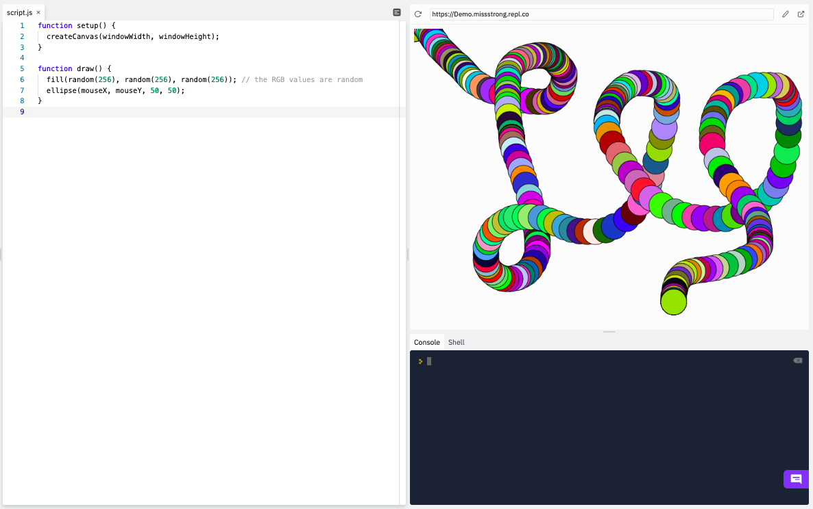

### Random Number Generator

**RNG** stands for **random number generator**. In P5.js, we have a function called `random()` that generates pseudorandom decimal numbers within a specified range. For example `random(50)` generates a random decimal number between 0 and 49.99999999999999 (yes, there are exactly 14 decimal places).

We can use this to generate random colours. The program below has a circle following the cursor where the circle constantly changes colours.

```js
function setup() {
  createCanvas(windowWidth, windowHeight);
}

function draw() {
  fill(random(256), random(256), random(256)); // the RGB values are random
  ellipse(mouseX, mouseY, 50, 50);
}
```



We may not want 60 colours flashing at us every second, so now would be a good time to use the `frameRate()` function. We can use this to change the frame rate from 60 frames per second to another number of frames.

```js
function setup() {
  createCanvas(windowWidth, windowHeight);
  frameRate(10); // the frame rate is now 10 frames per second instead of 60
}

function draw() {
  fill(random(256), random(256), random(256)); // the RGB values are random
  ellipse(mouseX, mouseY, 50, 50);
}
```


We can also generate random locations for shapes. Here is an example of a program that continuously draws colourful circles in various locations on the canvas.

```js
function setup() {
  createCanvas(windowWidth, windowHeight);
  background(255);
  frameRate(2); // the frame rate is now 2 frames per second instead of 60
}

function draw() {
  fill(random(256), random(256), random(256)); // the RGB values are random
  ellipse(random(width + 1), random(height + 1), 50, 50);
}
```


