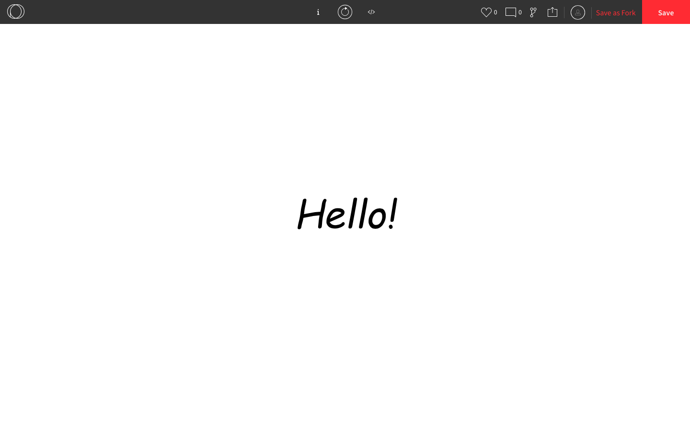

### Text

We can use strings to print text onto the canvas using the `text()` function. The `text()` function takes three parameters: the string, the x-coordinate, and the y-coordinate.

```js
function setup() {
  createCanvas(windowWidth, windowHeight);
  text("Hello!", width/2, height/2);
}
```


Here are some other things we can do with text:

* Change the colour using `fill()`
* Make the font smaller or bigger using `textSize()` 
* Change the font style using `textStyle()` and the following constants:
  * `NORMAL`, `ITALIC`, `BOLD`, `BOLDITALIC`

```js
function setup() {
  createCanvas(windowWidth, windowHeight);
  fill(0, 0, 255); // makes the text blue
  textSize(100); // makes the font size 100
  textStyle(ITALIC); // makes the text italicized
  textAlign(CENTER, CENTER); 
  text("Hello!", width/2, height/2);
}
```


* Align the text using `textAlign()` and the following constants:
  * `CENTER`, `TOP`, `BOTTOM`, `LEFT`, `RIGHT`

```js
function setup() {
  createCanvas(windowWidth, windowHeight);
  textSize(50);
  textAlign(LEFT, TOP);
  text("Hello!", 0, 0); // top-left
  textAlign(CENTER, CENTER);
  text("Hello!", width/2, height/2); // center
  textAlign(RIGHT, BOTTOM);
  text("Hello!", width, height); // bottom-right
}
```


We can also use any commercial-use font by uploading the **.ttf** (TrueType Font) or **.otf** (OpenType Font) file for it. We can use sites like [Google Fonts](https://fonts.google.com) to legally download these files. Once we download one we can drag it under **Files** on our Replit project. Then we load by calling `loadFont()` in the body of the `preload()` function. The `preload()` function is a function that we override, just like`setup()` and `draw()`. The `preload()` function runs only once (right befores `setup()`)and it is used to preloading any external files smoothly. To use the font on a specific string and set the font size, we call `textFont()` in `setup()`.

```js
function preload() {
  ephesis = loadFont("ephesis.ttf"); // "ephesis.ttf" is a file from Google Font
  // there's no "let" because we need to access this in variable in setup()
}

function setup() {
  createCanvas(windowWidth, windowHeight);
  textFont(ephesis, 100); // we can put the font size here instead of using textSize()
  fill(0, 0, 255); // makes the text blue
  textStyle(ITALIC); // makes the text italicized
  textAlign(CENTER, CENTER); 
  text("Hello!", width/2, height/2);
}
```


