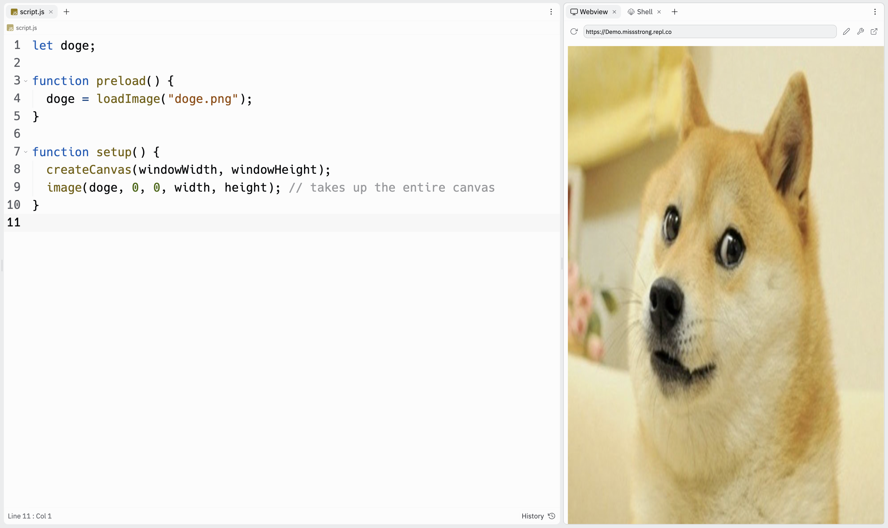

### Images

We can upload images and display them on the canvas. 

After we drag an image file under Files, we can call 'loadImage()` in `preload()` and `image()` in `setup()`.

```js
function preload() {
  doge = loadImage("doge.png"); // doge.png is the name of the image file
}

function setup() {
  createCanvas(windowWidth, windowHeight);
  image(doge, 0, 0); // the top-left corner of the image will be (0, 0)
}
```


By default, the coordinates we call in `image()` will be the top-left corner. If we want the coordinates to be the center of the image, we can call `imageMode(CENTER)`.

```js
function preload() {
  doge = loadImage("doge.png"); // doge.png is the name of the image file
}

function setup() {
  createCanvas(windowWidth, windowHeight);
  imageMode(CENTER); // the image() function below will take the center coordinates
  image(doge, width/2, height/2); // the center of the image will be (width/2, height/2)
}
```


By default, the image keeps its original dimensions. If we want to change the dimensions of the image, we can pass them as the fourth and fifth arugments in `image()`.

```js
function preload() {
  doge = loadImage("doge.png");
}

function setup() {
  createCanvas(windowWidth, windowHeight);
  imageMode(CENTER);
  image(doge, width/2, height/2, width, height); // takes up the entire canvas
}
```


