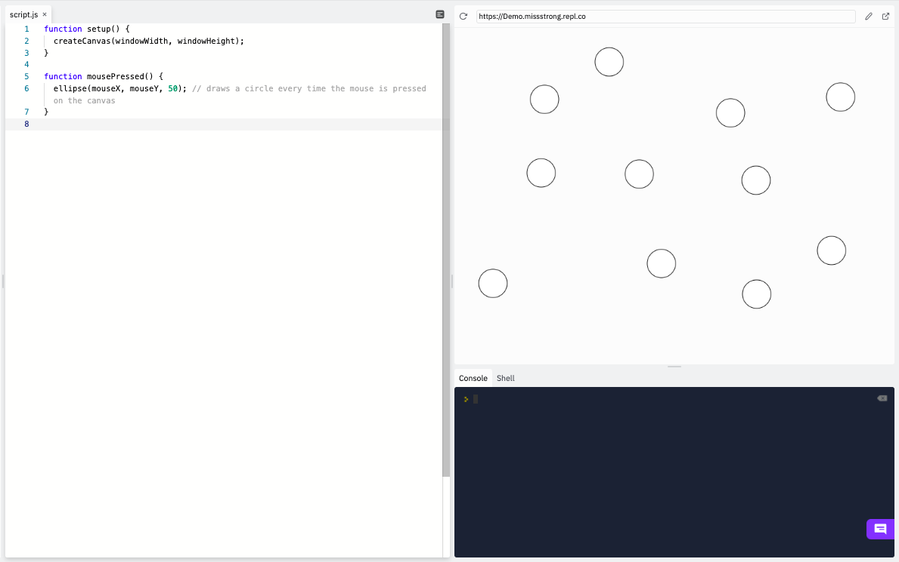

### Mouse Pressing

If we want to detect a mouse press, we can use the `mousePressed()` function. This type of function is called an  **event listener** or an **event handler**, since it gets called as soon as a particular event occurs. In this case, the event is a mouse button being pressed.

The way we use the `mousePressed()` function is similar to `setup()`, `preload()`, `draw()`.  We are overriding it, so we need the keyword `function` and we fill in the body of the function with what we want to happen when a mouse button is pressed. 

This example draws a circle in a random place each time the mouse is pressed.

```js
function setup() {
  createCanvas(windowWidth, windowHeight);
}

function mousePressed() {
  ellipse(random(width), random(height), 50);
}
```



If we want to know which mouse button was pressed, we can use the string variable `mouseButton`. It stores the values of `LEFT` (equivalent to `"left"`), `CENTER` (equivalent to `"center"`), or `RIGHT` (equivalent to `"right"`), depending on which one was most recently pressed. On a trackpad, a left click is the same as a one-finger click, a right click is the same as a two-finger click, and a middle click is the same as a three-finger click. 


```js
function setup() {
  createCanvas(windowWidth, windowHeight);
}

function mousePressed() {
  if (mouseButton == LEFT) { 
    print("You left clicked.");
  } else if (mouseButton == CENTER) {
    print("You middle clicked.");
  } else {
    print("You right clicked.");
  }
}
```


If we want something to happen when a mouse button is released as opposed to when it's first pressed, we can use `mouseReleased()` instead. However, in Replit this only works for left and midde clicks, since right clicking on the canvas open a menu.

```js
function setup() {
  createCanvas(windowWidth, windowHeight);
}

function mouseReleased() {
  if (mouseButton == LEFT) { 
    print("You let go of a the left mouse button.");
  }
}
```
