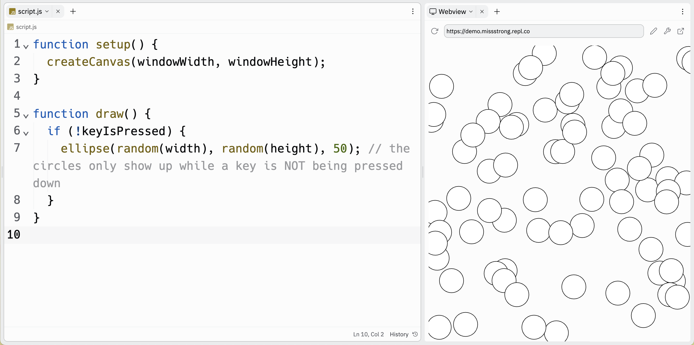

### Conditionals

A **conditional structure** is a section of code in which certain blocks are only run when certain conditions are met. We use Booleans to create these conditions.

The simplest type of conditional structure is called an **if statement**, which use the keyword `if`.

For an `if` statement, we have the keyword `if` followed by a Boolean value or expression in parenthesis, followed by a block of code enclosed in curly braces. In the block, we write the code that we want to run when the condition is met. 

Here is an example of an `if` statement. This draws a circle where the cursor is, but only when the mouse is pressed down.

```js
function setup() {
  createCanvas(windowWidth, windowHeight);
}

function draw() {
  if (mouseIsPressed) { 
    ellipse(mouseX, mouseY, 50, 50); // the circles only show up when the mouse is pressed down
  }
}
```


Here's another example. This one draws circles in random locations when any key on the keyboard is pressed down.

```js
function setup() {
  createCanvas(windowWidth, windowHeight);
}

function draw() {
  if (keyIsPressed) { 
    ellipse(random(width + 1), random(height + 1), 50); // the circles only show up when a key is being pressed down
  }
}
```


If we want the opposite value of a Boolean, we can use the **not operator**, which is the exclamation mark symbol `!`.

This is a slight modification of the first example. This draws a circle where the cursor is, but only when the mouse is NOT pressed down.

```js
function setup() {
  createCanvas(windowWidth, windowHeight);
}

function draw() {
  if (!mouseIsPressed) { 
    ellipse(mouseX, mouseY, 50, 50); // the circles only show up when the mouse is NOT pressed down
  }
}
```


This is a slight modification of the second example. This one draws circles in random locations when NO key on the keyboard is pressed down.

```js
function setup() {
  createCanvas(windowWidth, windowHeight);
}

function draw() {
  if (keyIsPressed) { 
    ellipse(random(width + 1), random(height + 1), 50); // the circles only show up when a key is NOT being pressed down
  }
}
```




