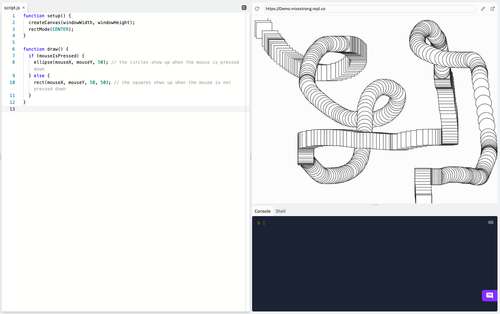
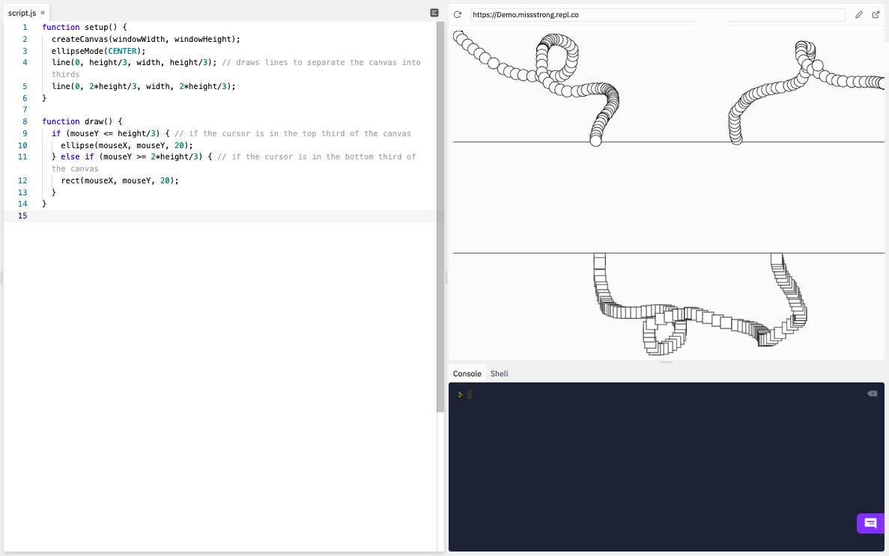
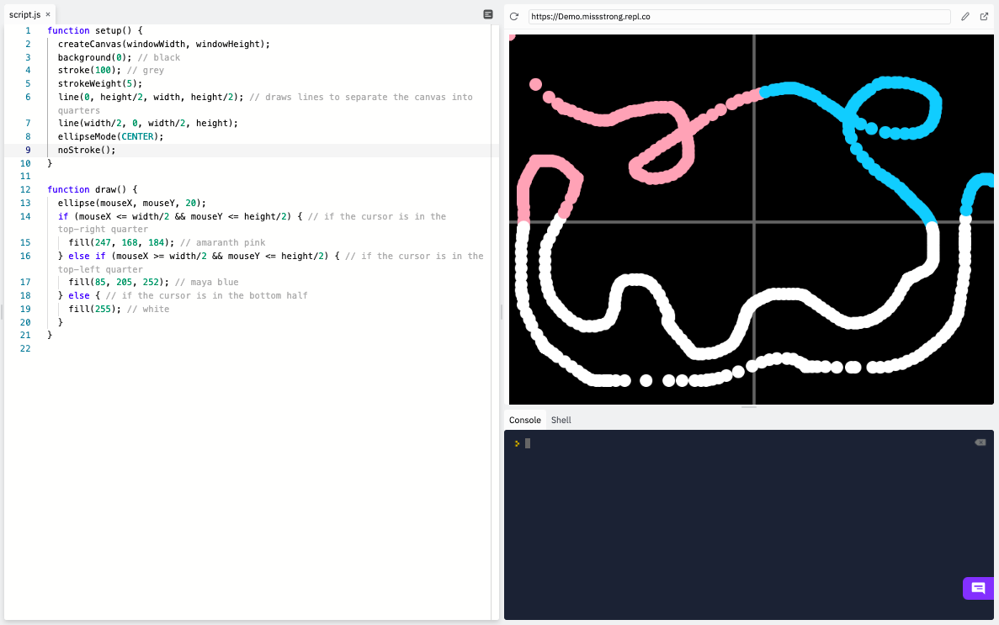

### Conditionals

Previously we saw how to use the conditional keyword `if`. Another conditional keyword is `else`, which is used alongside `if`. 

An `else` block only runs when the previous `if` condition was not met. We can think of it like the word "otherwise". Here is an example that draws circles when the mouse is pressed down and otherwise draws squares.

```js
function setup() {
  createCanvas(windowWidth, windowHeight);
  rectMode(CENTER);
}

function draw() {
  if (mouseIsPressed) { 
    ellipse(mouseX, mouseY, 50); // the circles show up when the mouse is pressed down
  } else {
    rect(mouseX, mouseY, 50, 50); // the squares shwo up when the mouse is not pressed down
  }
}
```



We can also have `else if` blocks. These run when a condition is met AND the previous `if` condition was *not* met.

```js
function setup() {
  createCanvas(windowWidth, windowHeight);
  ellipseMode(CENTER);
  line(0, height/3, width, height/3); // draws lines to separate the canvas into thirds
  line(0, 2*height/3, width, 2*height/3);
}

function draw() {
  if (mouseY <= height/3) { // if the cursor is in the top third of the canvas
    ellipse(mouseX, mouseY, 20); 
  } else if (mouseY >= 2*height/3) { // if the cursor is in the bottom third of the canvas
    rect(mouseX, mouseY, 20); 
  }
}
```



When we have`if`, `else if`, and `else` together.

```js
function setup() {
  createCanvas(windowWidth, windowHeight);
  background(0); // black
  stroke(100); // grey
  strokeWeight(5);
  line(0, height/2, width, height/2); // draws lines to separate the canvas into quarters
  line(width/2, 0, width/2, height);
  ellipseMode(CENTER);
  noStroke();
}

function draw() {
  ellipse(mouseX, mouseY, 20);
  if (mouseX <= width/2 && mouseY <= height/2) { // if the cursor is in the top-right quarter
    fill(247, 168, 184); // amaranth pink
  } else if (mouseX >= width/2 && mouseY <= height/2) { // if the cursor is in the top-left quarter
    fill(85, 205, 252); // maya blue
  } else { // if the cursor is in the bottom half
    fill(255); // white 
  }
}
```


