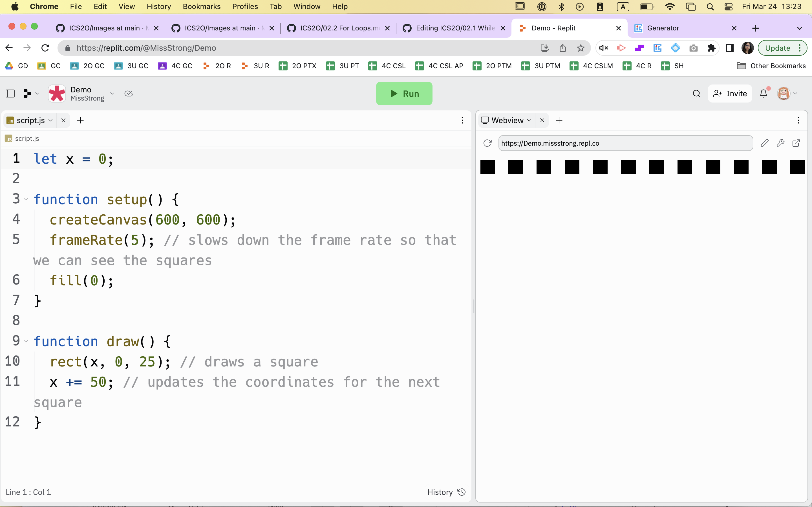
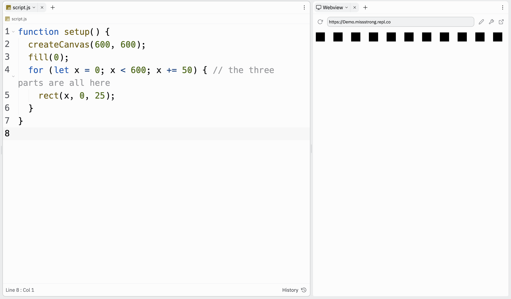

### For Loops

Another type of loop is a *for* loop. The syntax for a *for* loop looks different than a *while* loop, but it contains all the key parts:

* a variable getting initialized
* a boolean expression involving the variable that is repeatedly being checked
* the variable getting updated

Here is the example of a *while* loop from before with the three key parts shown.

```js
let x = 0; // a variable called x is getting initialized

function setup() {
  createCanvas(600, 600);
  fill(0);
  while (x < 600) { // we're checking if x is still less than 600
    rect(x, 0, 25); 
    x += 50 // the x variable is getting updated
  }
}
```

A *for* loop takes these three parts and puts them all on one line, separated by semicolons. The keyword `for` is used.

Here is the example from above rewritten using a *for* loop instead.

```js
function setup() {
  createCanvas(600, 600);
  fill(0);
  for (let x = 0; x < 600; x += 50) { // the three parts are all here
    rect(x, 0, 25); 
  }
}
```



Getting the syntax correct is important. For example, putting a semicolon between the `)` and the `{` causes the block to run exactly once and could cause scope problems.

```js
function setup() {
  createCanvas(600, 600);
  fill(0);
  for (let x = 0; x < 600; x += 50); { // the extra semicolon causes the problem
    rect(x, 0, 25); 
  }
}
```


