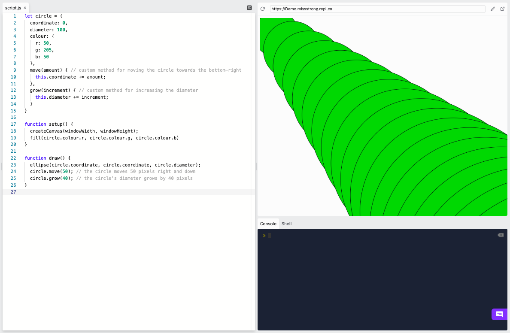

### Custom Methods

A method is a function that is performed on an object. Methods use dot notation: `objectName.methodName()`.

We can create our own methods inside of our own objects. Inside the object, we write the the name of the method followed by a set of parentheses and a set of curly braces. Inside the parentheses we put any parameters and inside the curly braces we write the body of the method.

To access the properties of the object inside the method, we use the keyword `this`, which gives us a copy of the object for us to use dot notation on. If we don't use `this`, then we will make a new variable instead of modifying the old one.

```js
let circle = { 
  coordinate: 0,
  diameter: 100,
  colour: {
    r: 50,
    g: 205,
    b: 50
  },
  move(increment) { // custom method for moving the circle towards the bottom-right
    this.coordinate += increment; 
  },
  grow(increment) { // custom method for increasing the diameter
    this.diameter += increment;
  }
}

function setup() {
  createCanvas(windowWidth, windowHeight);
  fill(circle.colour.r, circle.colour.g, circle.colour.b) 
}
  
function draw() {
  ellipse(circle.coordinate, circle.coordinate, circle.diameter); 
  circle.move(50); // the circle moves 50 pixels right and down
  circle.grow(40); // the circle's diameter grows by 40 pixels
}
```


