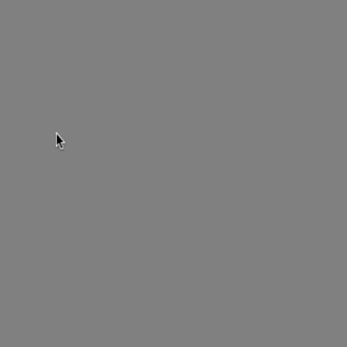

# [Link to video](https://www.youtube.com/watch?v=x7p18p-Nwjs&list=PLVD25niNi0BnaCreJK38l1-MVGhOFi4Mh)

### Mouse Clicking

If we want to detect a mouse click, we can use the `mousePressed()` function. This type of function is called an **event listener** or an **event handler**, since it gets called as soon as a particular event occurs. In this case, the event is a mouse button being pressed.

The way we use the `mousePressed()` function is similar to `setup()`, `preload()`, `draw()`.  We are overriding it, so we need the keyword `function` and we fill in the body of the function with what we want to happen when a mouse button is pressed. 

This example draws a circle in a random place each time the mouse is pressed.

```js
function setup() {
    createCanvas(400, 400);
    background(128);
}

function mousePressed() {
    ellipse(mouseX, mouseY, 50); // draws a circle every time the mouse is pressed
}
```



If we want something to happen when a mouse button is released after you've been holding it down, we can use `mouseReleased()` instead. 

```js
function mouseReleased() {
    ellipse(mouseX, mouseY, 50); // draws a circle every time the mouse is pressed
}
```

For double clicking the left mouse button, there's `doubleClicked()`.

```js
function doubleClicked() {
    ellipse(mouseX, mouseY, 50); // draws a circle every time the mouse is pressed
}
```
