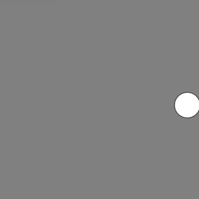

# [Link to video.](https://www.youtube.com/watch?v=h5oKp5c02WY&list=PLVD25niNi0BnaCreJK38l1-MVGhOFi4Mh)

### Key Pressing

If we want to detect a single key press, we can use the `keyPressed()` function. 

The way we use the `keyPressed()` function is identical to `mousePressed()`, except we use it to detect key presses instead of mouse presses. 

This example draws a circle in a random place each time a key is pressed.

```js
function setup() {
    createCanvas(windowWidth, windowHeight);
    background(128);
}

function keyPressed() {
    ellipse(random(width), random(height), 50);
}
```



If we want the circle to show up when we release a key, we can use `keyReleased()`.

```js
function setup() {
    createCanvas(windowWidth, windowHeight);
}

function keyReleased() {
    ellipse(random(width), random(height), 50);
}
```

Later, we'll see how to detect specific keys.
